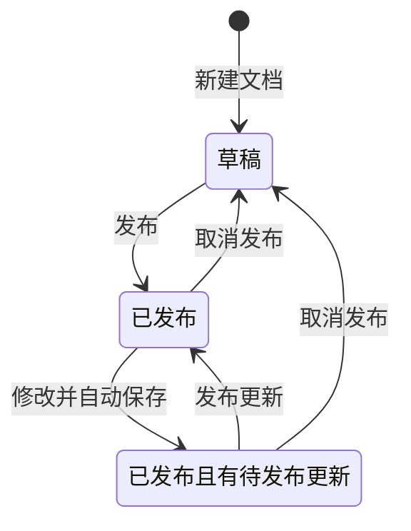
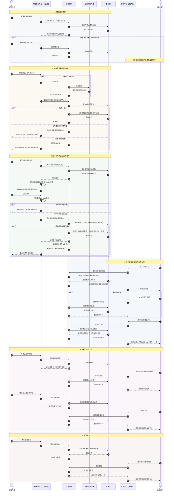

# AI Infra 文档发布中心产品设计

- 日期：2026-06-30
- 最近更新：2026-07-16
- 状态：已批准
- 适用系统：现有 AI Infra 管理系统
- 已知技术背景：React、Spring Boot、MyBatis
- 设计范围：产品与交互设计，不包含实现方案和技术选型
- 下游文档：[前后端详细技术设计](./2026-07-06-document-publishing-detailed-technical-design.md)

## 1. 背景

当前系统缺少由运营直接维护并即时发布的在线文档能力。文档内容需要脱离研发发版周期，使运营能够随时新增、编辑、预览、发布、更新和下架；用户在系统内的文档中心只看到已经明确发布的内容。

预计上线后 6～12 个月约有 30 篇文档，因此设计优先保证发布安全、编辑效率和技术文档阅读体验，不引入面向大规模知识库的复杂能力。

当前工作区未包含企业内部现有系统源码或完整设计规范。本文的产品决策已经确认，当前可先按独立参考工程实现；菜单、鉴权、文件存储和视觉规范的实际接入点在后续迁移到企业内网系统时替换适配。

## 2. 产品目标

1. 运营无需研发介入即可完成文档从创建到发布的全流程。
2. 草稿与线上内容严格隔离，任何编辑和保存都不能意外影响用户正在阅读的版本。
3. 用户能够通过文档树、标题搜索和页内目录快速定位内容。
4. 富文本能力覆盖 AI Infra 文档常见的图文、代码、表格、附件和流程图表达。
5. 多个运营偶发同时编辑时，系统不得静默覆盖他人的修改。

## 3. 成功标准

- 运营可在 5 分钟内完成“新建目录 → 创建图文文档 → 预览 → 发布”。
- 发布成功后无需重新部署系统，用户刷新即可看到新内容。
- 已发布文档被再次编辑时，用户持续看到上一次发布稿。
- 草稿标题、草稿正文和草稿附件不能通过任何用户端接口泄露。
- 并发编辑冲突不会造成静默覆盖。
- 管理端预览与用户端最终排版保持一致。

## 4. 用户角色

### 4.1 运营人员

在管理端维护文档树和内容，负责预览、发布、更新发布、取消发布及删除。无需实时协作，但可能有多个运营同时打开同一篇文档。

### 4.2 系统用户

通过已有菜单权限进入文档中心，阅读全部已发布文档。文档模块内部不再做角色、租户或用户组级别的可见范围控制。

## 5. MVP 范围

### 5.1 包含

- 目录与文档组成的树形管理。
- 新增、重命名、移动、排序、删除目录或文档。
- 富文本编辑与自动保存。
- 直接粘贴基础 Markdown，并转换为受控富文本内容。
- 标题、段落、粗体、斜体、列表、引用、链接、分割线。
- 图片、附件、表格、提示块、代码块与语法高亮。
- Mermaid 文本编辑与渲染预览。
- 用户视角预览。
- 发布、发布更新、取消发布。
- 草稿、已发布、已发布且有待发布更新的状态表达。
- 管理端和用户端的标题搜索。
- 并发编辑冲突保护。
- 稳定的文档访问地址。
- 桌面端完整布局和窄屏阅读适配。

### 5.2 不包含

- 实时协作、协同光标、在线成员状态。
- 评论、分享、导出。
- 文档级权限或可见范围。
- 审批流、定时发布。
- 历史版本、版本对比、一键回滚。
- 正文全文检索、相关性排序和搜索结果高亮。
- 拖拽式流程图编辑器。
- 视频和外部网页嵌入。
- 批量发布、批量下架和批量移动。

## 6. 核心产品模型

采用“编辑稿 / 线上稿双快照”模型。

每篇文档同时拥有：

- 编辑稿：运营当前编辑并自动保存的标题与正文。
- 线上稿：用户当前可见的标题与正文。

点击发布时，编辑稿的标题和正文作为一个整体覆盖线上稿。系统只保留当前编辑稿与当前线上稿，不产生用户可浏览的历史版本。

### 6.1 目录

- 仅用于分组、排序和折叠。
- 不承载正文。
- 没有草稿或发布状态。
- 目录名称、层级和顺序调整后立即影响用户端导航。

### 6.2 文档

- 承载标题、富文本正文和内容引用的资源。
- 是唯一发布单元。
- 文档标题属于发布内容，修改后需要再次发布才影响用户端。
- 管理端树显示编辑稿标题，用户端树显示线上稿标题。

## 7. 状态模型

### 7.1 业务状态

| 管理端表现 | 条件 | 用户端表现 |
|---|---|---|
| 草稿 | 从未发布或已取消发布 | 不可见 |
| 已发布 | 编辑稿与线上稿一致 | 可见 |
| 已发布 · 有待发布更新 | 已发布后又修改并保存 | 继续展示旧线上稿 |

“已发布 · 有待发布更新”是派生提示，不是独立发布状态。

### 7.2 状态转换

### 7.3 发布规则

- 发布必须同时更新标题与正文，不能让用户看到混合版本。
- 发布必须整体成功或整体失败。
- 发布失败时保留原线上稿，不产生半发布状态。
- 发布成功后记录发布时间和发布人。
- 取消发布立即从用户树隐藏文档，原访问地址不再返回正文。
- 取消发布不删除编辑稿。
- 已发布文档不能直接删除，必须先取消发布。

## 8. 文档树规则

- 节点类型仅有目录和文档。
- 最多四层目录。
- 同一目录下不允许出现重名节点。
- 禁止把目录移动到自身或其任意后代中。
- 非空目录不能删除。
- 用户端只返回已发布文档。
- 没有已发布后代的目录在用户端自动隐藏。
- 移动或排序已发布文档后，用户端导航立即同步。
- 文档稳定地址基于不可变标识，不依赖标题或目录路径。
- 用户直接进入文档中心时，默认打开树中第一篇已发布文档。
- 没有任何已发布文档时，用户端显示空状态，不展示空目录树。

## 9. 管理端体验

采用已确认的“双栏专注编辑”布局。

### 9.1 左侧文档树

- 展示全部目录和文档，包括草稿。
- 顶部提供“新建目录”和“新建文档”。
- 支持展开、折叠、拖拽排序和跨目录移动。
- 文档节点展示草稿、已发布或待发布更新标识。
- 右键或“更多”菜单提供重命名、创建子节点、移动和删除。
- 标题搜索仅过滤和定位管理端树，不改变原目录结构。

### 9.2 编辑区

- 标题位于正文上方并参与自动保存。
- 编辑区采用块级气泡工具栏：鼠标聚焦内容块时，左侧手柄显示该块当前类型；空段落显示“+”；点击或悬停手柄打开工具箱，工具箱只作用于当前块，不遮挡正文。
- 工具箱顶部以飞书式紧凑横排展示正文、H1～H5、无序列表、有序列表、任务清单、引用和代码块；插入、提示块及节点操作按纵向菜单展示，并为可用工具显示平台快捷键。
- 工具栏支持加粗、斜体、下划线、删除线、字体大小、字体颜色、缩进和对齐、链接、图片、附件、表格、代码块、提示块和 Mermaid。
- 有二级选项的“缩进和对齐”“颜色”“字号”等采用右侧级联菜单，不使用返回式覆盖；菜单打开时对应节点保持浅蓝高亮。
- “复制节点”只写入系统剪贴板，不自动插入副本；“删除节点”删除当前块并可通过编辑器撤销恢复。
- 表格块的气泡工具栏只提供表格入口和整表删除，不提供插入/删除行列；行列增删、选择和列宽调整在表格专用上下文工具条、表格边缘控件中完成。
- 点击表格块手柄可选中整张表格，随后按 Backspace/Delete 删除整表；单元格内删除不触发整表删除。
- 点击“表格”后打开飞书式尺寸选择器：可拖选 1×1～20×20 网格，也可输入行列数，默认插入首行表头。
- 支持直接粘贴基础 Markdown；Markdown 只是输入方式，保存格式仍为结构化富文本 JSON。
- 粘贴处理优先尝试 Markdown 解析；仅当 Markdown 解析失败时才按普通富文本或纯文本处理，不能把整段 Markdown 粘贴误判为代码块。
- 代码块支持语言选择与用户端语法高亮。
- 代码块顶部提供语言选择、语言搜索、自动换行和复制操作；语言选择更新结构化节点属性，自动换行只影响当前编辑会话。
- 代码块默认使用 Plain Text，不再通过插入弹框要求输入语言；不引入 Monaco 或 CodeMirror，不支持行号、折叠、执行、格式化或语言服务。
- Mermaid 以源码编辑、即时预览的方式工作，不提供拖拽画布。
- 图片支持上传、替换、删除、替代文本和说明文字。
- 附件展示文件名、文件类型和大小，并允许用户下载。

### 9.3 顶部操作区

- 始终显示当前业务状态。
- 显示“保存中”“已保存”“保存失败”或“编辑冲突”。
- 提供“用户视角预览”。
- 草稿状态显示“发布”。
- 有待发布更新时显示“发布更新”。
- “取消发布”和“删除”放入低频操作菜单并要求确认。

### 9.4 自动保存

- 用户停止输入后自动保存，不提供依赖手动点击的主保存流程。
- 自动保存与发布完全分离，保存永远不会触发发布。
- 保存失败时保留当前页面内容并持续显示失败状态。
- 存在未保存内容时离开页面，需要明确提醒。

### 9.5 预览

- 使用与用户端相同的渲染组件和样式。
- 读取编辑稿，而非线上稿。
- 打开预览前先完成当前自动保存队列；保存成功后直接使用当前编辑稿和共享阅读组件渲染，不建立独立草稿预览接口。
- 可验证图片、附件、代码高亮、表格、链接、页内目录和 Mermaid。
- 预览仅在管理端权限范围内访问，不能生成对普通用户可访问的草稿链接。

### 9.6 单页工作台与固定区域

- 用户端 `/document-center` 与 `/document-center/:documentId` 共用一个页面组件；管理端 `/admin/document-center` 与带文档 ID 的地址也共用一个页面组件。
- 管理端单页同时承载文档树管理和右侧编辑器：目录选择只改变树操作上下文，不卸载或切换当前编辑器；点击文档才切换正文并更新 URL。
- 管理端左侧文档树固定在视口并独立滚动；右侧编辑操作栏固定在顶部；用户端左侧树和右侧页内目录均固定并各自处理溢出滚动。
- 旧的带文档 ID 地址继续可访问，根路径自动定位到默认文档；删除或下架文档时保留明确错误态。

## 10. 用户端体验

采用已确认的“三栏技术文档阅读”布局。

### 10.1 全局导航

- 左侧展示只包含已发布文档的文档树。
- 当前文档在树中高亮，父目录自动展开。
- 用户可折叠和展开目录。
- 标题搜索只检索线上稿标题。
- 搜索结果点击后打开稳定文档地址。

### 10.2 正文阅读

- 中间区域展示线上稿标题、最后发布时间和正文。
- 图片自适应正文宽度，并展示替代文本或说明文字。
- 代码块展示语言标识、语法高亮和复制操作。
- 代码块阅读端复用共享语言目录和规范化规则；未知语言保留原始标识并按纯文本展示，不因未知语言导致阅读端报错。
- Mermaid 渲染为安全的图形内容。
- 附件显示文件名、类型、大小和下载操作。
- 文末按文档树顺序提供上一篇和下一篇。

### 10.3 页内目录

- 右侧根据正文中的二级、三级标题自动生成。
- 点击后滚动到对应锚点。
- 阅读滚动时高亮当前章节。
- 窄屏下隐藏右侧页内目录。

### 10.4 窄屏适配

- 左侧文档树收进抽屉。
- 正文占满可用宽度。
- 页内目录隐藏，可通过正文标题完成浏览。
- 管理端以桌面使用为主，不把手机编辑纳入 MVP 验收。

### 10.5 下架与不存在

- 文档取消发布或删除后，旧地址展示“文档不存在或已下架”。
- 页面提供返回文档中心入口。
- 不返回线上稿正文，也不暴露草稿信息。

## 11. 内容能力与约束

### 11.1 图片

- 默认支持 JPG、PNG、WebP。
- 默认单文件不超过 10MB。
- 上传未完成或失败时禁止发布。
- SVG 默认不开放，除非实施阶段能证明上传与渲染链路具备可靠的安全净化。

### 11.2 附件

- 支持上传并在用户端下载。
- 类型白名单和大小由系统配置。
- 默认单文件不超过 50MB。
- 附件原始文件名、类型和大小对用户可见。
- 草稿附件不能通过普通用户接口直接访问。

### 11.3 Mermaid

- 支持 Mermaid 源码输入与预览。
- 官方管理端在预览和发布前校验 Mermaid 语法；语法错误时定位具体内容块并阻止发起发布请求。
- 后端负责 Mermaid 节点结构、源码大小和安全属性校验，不在 MVP 中运行完整 Mermaid 语法解析器。
- 渲染结果必须经过安全处理，不能执行脚本或加载未授权内容。

### 11.4 链接与富文本

- 正文在用户端渲染前进行安全过滤。
- 禁止脚本、事件属性和危险协议。
- 外部链接明确标识并在新窗口打开。
- 不支持 iframe 或任意 HTML 嵌入。

### 11.5 编辑器结构化能力

- 持久化节点属性仅允许产品声明的对齐、缩进、字号和安全色板枚举；编辑态、预览态和用户端使用同一套渲染规则，避免工具栏设置后只在预览生效。
- 表格保留 Tiptap 原生表格 Schema，支持行列新增/删除、单元格合并/拆分、首行表头切换、列宽拖动和整表删除；表格上下文工具条不得与块级气泡工具栏重复提供同一组行列操作。
- 表格插入尺寸选择器最多展示 20×20；表格边缘控件负责“在指定位置”插入行列，表格行列句柄负责精确选择目标行列。
- Mermaid 代码块在保存前按语言标识识别并渲染为 Mermaid；普通代码块继续按代码块展示，不能仅因内容包含 `flowchart` 文本就误渲染。
- 普通代码块语言目录至少覆盖 Plain Text、Bash/Shell、CSS、HTML/XML、Java、JavaScript、JSON、Markdown、Python、SQL、TypeScript 和 YAML；语言值与别名统一规范化后持久化稳定值。
- 代码块 NodeView 的工具栏必须设置为不可编辑区域，语言菜单、搜索、换行和复制不能把操作文本写入代码正文，也不能破坏选区、撤销和重做。
- 代码块关闭自动换行时仅代码正文区域横向滚动，不能撑破编辑器或阅读容器；复制失败必须显示明确失败反馈。

## 12. 并发冲突保护

本模块不做实时协作，但必须处理两名运营同时编辑的情况。

- 打开文档时获得当前编辑稿版本标识。
- 自动保存时校验该版本标识。
- 如果其他人已保存新版本，则拒绝当前保存。
- 页面进入“编辑冲突”状态，停止后续自动保存。
- 当前页面内容继续保留，允许用户复制。
- 用户刷新后读取最新内容，再自行合并必要修改。
- 禁止采用“最后保存者自动覆盖”的策略。

MVP 不提供自动合并、差异对比或协同锁定。

## 13. 概念组件与职责

本节只定义产品边界，不锁定代码实现。

| 组件 | 职责 |
|---|---|
| 文档树管理 | 维护目录、文档位置与排序，生成管理端和用户端两种树 |
| 草稿编辑 | 保存编辑稿标题、正文和资源引用，处理自动保存与冲突 |
| 发布服务 | 校验编辑稿并原子更新线上稿，处理取消发布 |
| 内容渲染 | 为管理端预览和用户端阅读提供一致、安全的渲染结果 |
| 资源管理 | 上传和访问图片、附件，隔离草稿资源与已发布资源 |
| 标题搜索 | 管理端搜索编辑稿标题，用户端搜索线上稿标题 |
| 代码块编辑与渲染 | 管理端提供语言选择、语言搜索、自动换行和复制；编辑、预览和用户端共享语言目录与高亮/纯文本回退规则 |
| 审计信息 | 记录创建人、最后编辑人、发布人和相应时间 |

## 14. 概念数据边界

### 14.1 目录

至少包含不可变标识、父目录、名称、排序值、创建和更新时间。

### 14.2 文档

至少包含：

- 不可变标识、所属目录、排序值。
- 编辑稿标题和结构化富文本内容。
- 线上稿标题和结构化富文本内容。
- 是否处于发布状态。
- 编辑稿版本标识，用于并发冲突保护。
- 编辑稿是否与线上稿一致的判断依据。
- 创建人、最后编辑人、发布人及相应时间。

### 14.3 资源

至少包含资源标识、原始文件名、类型、大小、存储位置、上传人和上传时间。资源访问必须区分管理端草稿场景与用户端已发布场景。

## 15. 关键数据流

### 15.1 编辑和自动保存

1. 运营打开文档，读取编辑稿和版本标识。
2. 运营修改标题或正文。
3. 页面显示“保存中”。
4. 服务端校验版本标识并保存编辑稿。
5. 成功后返回新版本标识，页面显示“已保存”。
6. 若文档已有线上稿，则状态显示“已发布 · 有待发布更新”。

### 15.2 代码块编辑

1. 运营插入代码块，节点默认保存 `attrs.language = "plaintext"`。
2. 运营打开代码块语言菜单，可按名称、稳定值或别名搜索并选择语言。
3. NodeView 通过 `updateAttributes({ language })` 更新节点属性，触发现有自动保存。
4. 运营切换自动换行时只改变当前编辑会话的展示，不修改文档 JSON。
5. 预览和用户端读取同一语言属性；已注册语言执行高亮，未知语言保留原值并按纯文本展示。

### 15.3 发布

1. 运营点击发布或发布更新。
2. 官方管理端完成自动保存并校验 Mermaid 语法；语法错误时不发起发布请求。
3. 后端校验标题、正文结构和数据库中的资源 READY 状态。
4. 后端将编辑稿标题、正文和资源引用整体写入线上稿。
5. 系统记录发布人与发布时间。
6. 成功后用户端读取新线上稿；失败则继续读取旧线上稿。

### 15.4 用户阅读

1. 用户进入文档中心。
2. 系统返回只包含已发布文档的树。
3. 用户打开文档，系统按稳定标识读取线上稿。
4. 页面渲染正文并根据二、三级标题生成页内目录。

## 16. 端到端用户旅程时序图

下图串联运营建树、草稿编辑、资源上传、自动保存、预览、首次发布、用户阅读、再次更新和取消发布，同时纳入并发冲突与发布失败两条关键异常支线。

这条旅程体现三个不可破坏的产品原则：自动保存不等于发布；用户端只读取线上快照；失败、冲突或待发布更新都不能静默改变用户正在阅读的版本。

## 17. 错误处理

| 场景 | 产品行为 |
|---|---|
| 自动保存失败 | 保留内容，持续显示失败，不误报已保存 |
| 并发编辑冲突 | 拒绝覆盖，停止自动保存，允许复制后刷新 |
| 图片或附件上传失败 | 标记失败资源，禁止发布 |
| Mermaid 语法错误 | 官方管理端定位错误块，不发起发布请求 |
| 代码块复制失败 | 保留代码内容，工具栏显示“复制失败”，不静默失败 |
| 代码块语言未知 | 保留原始语言值，编辑端继续显示，阅读端按纯文本回退 |
| 发布失败 | 旧线上稿继续可见，管理端保留编辑稿 |
| 取消发布失败 | 用户端继续可见，管理端明确提示未下架 |
| 用户访问草稿或已下架文档 | 返回不存在或已下架页面，不泄露内容 |
| 用户树为空 | 显示文档中心空状态 |
| 稳定地址对应文档被删除 | 显示不存在或已下架页面 |

## 18. 安全与隐私要求

- 用户端数据查询只允许读取已发布快照。
- 草稿预览只能在管理端鉴权范围访问。
- 富文本、链接和 Mermaid 渲染结果需要安全净化。
- 上传文件使用类型与大小限制，禁止被当作可执行页面直接运行。
- 用户端附件下载必须确认资源属于当前已发布文档。
- 管理端操作复用现有后台访问控制；文档模块不新增文档级权限模型。
- 删除、取消发布等破坏性操作需要明确确认。

## 19. 验收场景

1. 新建文档后，仅管理端可见。
2. 发布后，文档出现在正确目录并可通过稳定地址访问。
3. 修改已发布文档后，用户仍看到旧标题和旧正文。
4. 发布更新后，标题和正文同时切换。
5. 取消发布后，文档从用户树消失，原地址不再返回正文。
6. 调整目录、位置和排序后，用户导航立即同步。
7. 只含草稿文档的目录不会出现在用户树。
8. 两名运营同时编辑时，后保存者无法覆盖前者。
9. 自动保存失败时，页面内容仍在且状态明确。
10. 管理端可将基础 Markdown 粘贴转换为受控富文本，且预览与用户端在富文本、图片、代码、表格和 Mermaid 上一致。
11. 管理端搜索全部编辑稿标题，用户端只搜索线上稿标题。
12. 修改标题或移动目录后，稳定访问地址仍然有效。
13. 发布失败时，用户继续看到完整旧版本。
14. 后端拒绝发布包含未就绪资源的文档；官方管理端遇到 Mermaid 语法错误时不能发起发布请求。
15. 用户不能通过文档或资源接口访问草稿内容。
16. 块级气泡工具栏能定位并高亮当前鼠标所在节点；复制节点只进入剪贴板，表格气泡工具栏不显示插入/删除行列。
17. 表格可通过网格或数字输入创建，可在指定位置增删行列，可选中整表后用 Backspace/Delete 删除，单元格内删除不会误删整表。
18. 管理端编辑态对标题级别、对齐、缩进、颜色、字号、列表、引用、代码块、表格和 Mermaid 的视觉效果与预览/用户端一致。
19. 用户端和管理端文档中心均只有一个页面入口组件，原有根路径和带 ID 路径均可刷新访问。
20. 代码块默认以 Plain Text 创建；语言菜单支持名称、稳定值和别名搜索，选择后刷新仍保持语言属性。
21. 代码块自动换行可即时切换且不写入文档 JSON；关闭换行时正文区域可横向滚动，不撑破容器。
22. 代码块复制成功和失败均有明确反馈，工具栏操作不会插入正文或破坏撤销/重做；用户端对未知语言安全回退为纯文本。

## 20. 产品风险与处理

### 20.1 树结构即时生效，正文需要发布

运营可能移动一篇已发布文档，但尚未发布其编辑稿。用户会立即看到新位置，但仍读取旧标题和旧正文。该行为是已确认的简化取舍，管理端应在拖拽已发布文档时提示“导航位置将立即对用户生效”。

### 20.2 管理端标题与用户端标题可能短暂不同

运营修改标题但尚未发布时，管理端树显示新标题，用户端树显示旧标题。这是双快照模型的预期行为，状态标签必须清楚显示“有待发布更新”。

### 20.3 不提供历史回滚

误发布后只能重新编辑并发布修正稿，或立即取消发布。发布确认文案需要明确说明内容将立刻对用户可见。

### 20.4 草稿资源泄露

如果图片和附件使用可猜测的永久直链，可能绕过文档状态。资源访问必须纳入发布态校验，不能只靠页面隐藏。

## 21. 后续候选能力

只有出现真实需求后再评估：

- 历史版本与回滚。
- 定时发布和审批流。
- 正文全文检索。
- 文档级可见范围。
- 批量操作。
- 外部内容嵌入。
- 可视化流程图编辑器。
- 阅读量、搜索无结果率和内容反馈。

## 22. 已确认的关键决策

- 目录没有正文和发布状态。
- 文档采用编辑稿 / 线上稿双快照。
- 已发布内容继续编辑时，用户保持看到上一次发布稿。
- “有待发布更新”是派生提示，不是第三种发布状态。
- 支持取消发布。
- 不提供历史版本和回滚。
- 目录结构变化即时生效，文档标题随正文发布。
- 文档模块内部不做权限分层。
- 预计约 30 篇文档，只做标题搜索。
- 支持附件下载和 Mermaid，不支持外部嵌入。
- 支持直接粘贴基础 Markdown；Markdown 仅作为输入方式，持久化格式仍为结构化 JSON。
- Mermaid 完整语法由官方管理端校验，后端只校验结构、大小和安全属性。
- 草稿自动保存，发布必须主动触发。
- 需要用户视角预览。
- 需要并发冲突保护，不做实时协作。
- 管理端采用双栏专注编辑。
- 用户端采用文档树、正文、页内目录三栏布局。
- 管理端与用户端各采用单页工作台，根路径和带文档 ID 路径复用同一页面组件。
- 块级气泡工具栏采用飞书式单列/紧凑横排混合布局；表格行列操作归属表格专用上下文工具条，不放入块级气泡工具栏。
- 表格插入支持网格拖选和数字输入；整表 NodeSelection 支持 Backspace/Delete 删除。
- 编辑态必须尽量与阅读态视觉一致，特殊节点（Mermaid、上传资源等）可保留专用编辑控件。
- 代码块采用自定义 React NodeView，支持语言选择、语言搜索、自动换行和复制；不引入第二套编辑器内核。
- 代码块语言属性由编辑、预览和用户端共享目录统一管理，未知语言保留并安全回退为纯文本。

## 23. 实施规划前需要验证的现有系统条件

这些项目不改变已确认的产品设计，但会影响后续技术计划：

- 现有菜单与后台访问控制的接入方式。
- 现有文件存储、上传、下载和安全扫描能力。
- 现有统一审计字段与用户身份获取方式。
- 现有 React 设计系统、路由和富文本依赖。
- 现有 Spring Boot 模块边界、异常规范和事务约定。
- 当前数据库类型及对 JSON 或大文本内容的存储约束。

## 24. 可视化探索记录

- 管理端布局：双栏专注编辑方案。
- 用户端布局：文档树、正文、页内目录三栏方案。
- 会话线框记录位于 `.superpowers/brainstorm/`，仅作为设计过程参考。
