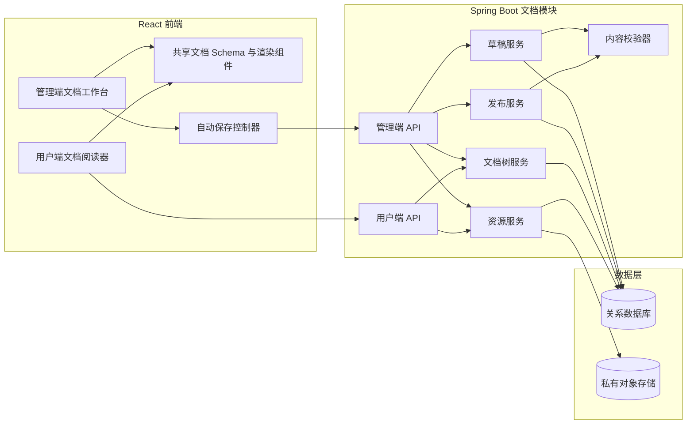

# AI Infra 文档发布中心前后端技术调研

- 初稿日期：2026-07-01
- 后端 POM 复核日期：2026-07-05
- 前端技术栈复核日期：2026-07-06
- 状态：已按父 POM、明确前端技术栈和 2026-07-06 一致性复核结论完成校准
- 后端项目结构规范补充日期：2026-07-08
- 依据：[AI Infra 文档发布中心产品设计](./2026-06-30-document-publishing-center-design.md)
- 已确认父 POM 基线：Java 11、Spring Boot 2.3.12.RELEASE、Maven 多模块；统一管理 MyBatis-Plus 3.5.1、Jackson 2.15.2、MapStruct 1.5.3.Final 等版本
- 已确认前端基线：`@umijs/max@4.5.3`、`tailwindcss@3.4.17`、`typescript@4.9.5`
- 范围：技术选型、架构、数据模型、API、重点难点、安全与测试；不包含实现代码
- 下游文档：[前后端详细技术设计](./2026-07-06-document-publishing-detailed-technical-design.md)

## 1. 结论先行

建议采用以下技术路线：

1. 前端富文本编辑器选用 **Tiptap 3.x**，以 Tiptap/ProseMirror JSON 作为文档规范格式。
2. 管理端编辑器与用户端阅读器共用一份文档 Schema、扩展清单和展示组件；用户端使用 Tiptap Static Renderer 输出 React 元素，不启动可编辑实例。
3. 附件、提示块、Mermaid 使用自定义节点；代码块使用 CodeBlockLowlight；表格使用 TableKit。
4. 页内目录直接遍历 JSON 中的 H2/H3 生成，不依赖 Tiptap 私有 Registry 中的目录扩展。
5. 后端在独立参考工程中按目标企业包结构增加文档领域包；MyBatis-Plus 负责简单单表 CRUD，自定义 Mapper XML 负责 revision 条件更新、发布、资源引用切换和树重排，不引入 JPA。
6. 数据库保存“编辑稿 / 线上稿”双快照和递增的 `draft_revision`。自动保存使用条件更新检测冲突。
7. 发布动作在一个 Spring 数据库事务中完成：校验编辑稿版本、复制标题与 JSON、替换线上资源引用、记录发布人和时间。
8. **对象存储不参与发布事务。** 当前独立工程通过 `DocumentObjectStorage` 抽象接入 MinIO S3 兼容对象存储；图片和附件先上传并在数据库标记为 `READY`，发布事务只切换数据库引用；迁移到企业内网后再替换为 `platform-support-storage-v2` 适配器。
9. 对象存储保持私有；内容 JSON 只保存 `assetId`，不保存永久文件 URL。读取资源前由后端校验其是否属于当前线上稿，再通过存储适配器返回短期地址或代理文件流。
10. 管理端 API 与用户端 API 使用不同的查询、DTO 和资源鉴权路径，避免“字段隐藏不严”导致草稿泄露。
11. 当前 POM 中 Redis、Elasticsearch、Kafka、Caffeine、PageHelper 等大多只是 `dependencyManagement` 中的版本目录，不因“已管理”就接入文档发布主链路。
12. 前端沿用 Umi Max 路由、菜单、请求和默认按页拆包能力；Tailwind 只负责界面与受控阅读样式，不把任意 class 写入文档 JSON；TypeScript 4.9.5 下必须先验证并锁定可编译的 Tiptap 3 精确版本。

这套方案与约 30 篇文档的规模匹配。它把复杂度放在真正不能出错的地方：草稿隔离、发布原子性、资源权限和并发保护；不为当前不需要的协作、版本历史和大规模搜索付费。

## 2. 调研边界与已知技术基线

本次拿到的是父 POM 内容。它可以确认工程基线和统一版本目录，但 `dependencyManagement` 中的条目只代表版本可用，本身不会把依赖加入运行时。因此本文用它约束可选技术版本，不把每个已管理组件都认定为文档模块必须使用的依赖。[Maven Dependency Management](https://maven.apache.org/guides/introduction/introduction-to-dependency-mechanism.html#dependency-management)

| 证据等级 | 从父 POM 得到的结论 |
|---|---|
| 已确认 | Java 11、Spring Boot 2.3.12.RELEASE、Maven 多模块工程 |
| 已管理 | MyBatis-Plus 3.5.1、MyBatis Spring Boot Starter 2.1.4、PageHelper Starter 1.3.0 |
| 已管理 | Jackson 2.15.2、MapStruct 1.5.3.Final、Hibernate Validator 6.1.7.Final |
| 父 POM 直接依赖 | OceanBase Connector/J 2.4.0、Sentinel 相关组件、Lombok |
| 已管理 | MySQL Connector/J 8.0.33、Druid Starter 1.1.10 |
| 已管理 | Medis2、Spring Data Redis 2.7.18、Lettuce 6.2.1、Reactor 3.4.36、Caffeine 2.3.5 |
| 已管理 | Sentinel 1.8.5、Knife4j 2.0.9、Nacos Client 2.2.3、Kafka Client 2.5.1、Elasticsearch Java Client 8.12.2 |
| 内部平台能力 | `platform-support-web-v2`、`platform-support-storage-v2`、字典、审计 SDK 版本属性与消息总线 SDK |

这里有三个必须避免的误判：

1. `com.oceanbase:oceanbase-client:2.4.0` 是 **OceanBase Connector/J 驱动版本**，不是 OceanBase 数据库服务端版本，也不能据此判断服务端是否支持 JSON 字段、CTE 或某种唯一索引语义。官方文档也将其定义为 JDBC Type 4 驱动。[OceanBase Connector/J](https://en.oceanbase.com/docs/oceanbase-connector-j-en)
2. 父 POM 同时管理 MySQL 和 OceanBase 驱动，只能说明工程具备两类连接选项；实际数据库类型、版本和 OceanBase 租户模式仍未知。
3. 企业 POM 管理了内部存储 SDK。独立参考工程为完成本机 MinIO 端到端验证，可以在 adapter 层引入 AWS SDK v2 S3 客户端；迁移企业仓库时优先替换为 `platform-support-storage-v2`。

Spring Boot 2.3.12 与 Java 11 本身兼容；官方基线是 Spring Framework 5.2.15 和 Servlet 4.0。[Spring Boot 2.3 系统要求](https://docs.spring.io/spring-boot/docs/2.3.12.RELEASE/reference/htmlsingle/#getting-started-system-requirements) 本文不要求为文档模块升级主框架，但所有实现都必须使用这一代 API，不能引用 Spring Boot 3 / Spring Framework 6 示例。

用户已确认其他后端子模块与本需求无关，本次不再要求补充或分析它们。编码阶段只需在实际承载文档功能的现有服务模块中做常规依赖树检查，不把它作为技术调研的前置材料。

前端基线已经明确：

| 组件 | 版本 | 对本模块的直接影响 |
|---|---:|---|
| `@umijs/max` | 4.5.3 | 复用 Umi 4 路由、Layout/菜单、request 插件和默认按页拆包 |
| `tailwindcss` | 3.4.17 | 复用现有 Tailwind 配置；需处理 Preflight 对富文本语义标签的重置 |
| `typescript` | 4.9.5 | 可使用 `satisfies` 和判别联合；新增前端依赖必须通过 TS 4.9 实际类型检查 |

Umi Max 集成了布局、菜单、请求、权限、Tailwind 等插件，但“框架内置”不代表项目已经全部启用；实现时读取现有 `config/config.ts` 或 `.umirc.ts`、`src/app.tsx`、`tailwind.config.*` 和请求封装，沿用当前工程配置，不重新生成或并行搭建一套。[Umi Max 简介](https://umijs.org/docs/max/introduce)

仍需在实际开发前确认的只剩与本模块直接相关的仓库事实：

- React 精确版本、包管理器与 lockfile 中最终解析出的 Tiptap/ProseMirror 依赖。
- 真实数据库服务端、字符集/排序规则、迁移工具及 JSON/CLOB 使用惯例。
- 内部 Web、存储、鉴权、审计、异常和 ID 生成接口。
- 当前 Umi 路由、菜单、request、Tailwind content/Preflight 与前端测试配置。

## 3. 推荐总体架构



### 3.1 架构原则

- 文档 JSON 是内容源，DOM 和 HTML 不是内容源。
- 草稿与线上稿在数据库层明确分栏，不靠状态过滤同一份内容。
- 发布是同步、短事务，不经过消息队列。
- 对象先通过现有存储 SDK 准备，数据库后引用，避免分布式事务。
- 预览与阅读共用同一渲染组件，减少“预览正确、发布错位”。
- 用户端从查询入口就只读取线上字段，而不是查询完整对象后再删草稿字段。
- 当前规模下所有文档节点可一次查询并在内存构树，不使用递归 CTE 或搜索引擎。

## 4. 富文本编辑器技术选型

### 4.1 候选比较

| 方案 | 优点 | 缺点 | 结论 |
|---|---|---|---|
| Tiptap 3.x | React 官方集成；ProseMirror Schema；JSON；TableKit；CodeBlockLowlight；自定义 Node/NodeView；Static Renderer；核心 MIT | UI、上传流程和自定义节点仍需自行实现；Schema 升级需治理；部分高级扩展在私有 Registry | **推荐** |
| Lexical | MIT；状态快照可 JSON 序列化；React 扩展/插件体系；表格和目录能力完整；性能与可访问性好 | 需要自行组装更多编辑器行为与展示层；自定义块、静态阅读映射和完整工具栏工作量不低 | 合理备选 |
| CKEditor 5 | 开箱即用程度高；成熟工具栏和企业功能 | 非 GPL 商业系统通常需要商业许可；自定义 Mermaid 与产品化附件仍要开发；容易引入付费能力依赖 | 不优先 |

Tiptap 的官方文档确认了 React 集成、`getJSON()`、只读模式、扩展机制和 Static Renderer。TableKit 与 CodeBlockLowlight 已覆盖当前产品的关键基础块，自定义 Node 足以承载附件、提示块和 Mermaid。[React 集成](https://tiptap.dev/docs/editor/getting-started/install/react)、[Static Renderer](https://tiptap.dev/docs/editor/api/utilities/static-renderer)、[Table](https://tiptap.dev/docs/editor/extensions/nodes/table)、[CodeBlockLowlight](https://tiptap.dev/docs/editor/extensions/nodes/code-block-lowlight)、[自定义扩展](https://tiptap.dev/docs/editor/extensions/custom-extensions)

Tiptap 核心仓库采用 MIT 许可；实施时仍要逐项核对选用扩展，避免误用 Cloud、Pro 或私有 Registry 能力。[Tiptap GitHub](https://github.com/ueberdosis/tiptap)

Lexical 也具备 JSON EditorState、React 扩展、表格和目录等能力，是最有价值的备选。但本项目需要多个自定义文档块、编辑/阅读同构和成熟的 ProseMirror 生态，Tiptap 的集成路径更短。[Lexical Editor State](https://lexical.dev/docs/concepts/editor-state)、[Lexical React Plugins](https://lexical.dev/docs/react/plugins)

CKEditor 5 的官方许可说明表明，不满足 GPL 条件的商业系统需要商业许可，因此除非现有公司已采购，不建议作为默认方案。[CKEditor 5 许可说明](https://ckeditor.com/docs/ckeditor5/latest/getting-started/licensing/license-key-and-activation.html)

### 4.2 必做技术验证 Spike

在正式排期前，用 `@umijs/max@4.5.3 + typescript@4.9.5` 的真实工程做一个 2～3 天的编辑器验证，必须同时通过：

1. 中文输入法、普通复制粘贴、基础 Markdown 直接粘贴、撤销重做稳定。
2. 表格插入、合并、复制和窄屏横向滚动可用。
3. Bash、YAML、JSON、Python、Java、SQL、JavaScript/TypeScript 代码块高亮可用。
4. 自定义附件节点能上传、失败重试、删除和只读渲染。
5. 自定义 Mermaid 节点能编辑源码、预览、显示语法错误和只读渲染。
6. JSON 保存后重新载入无丢失。
7. Static Renderer 与编辑器只读模式输出一致。
8. Umi 生产构建能把管理端编辑器、Mermaid 和代码高亮从普通用户首屏拆开。
9. 项目现有 TypeScript 检查在 4.9.5 下通过，不靠新增 `skipLibCheck`、全局 `any` 或降级声明文件绕过依赖类型错误。
10. Tailwind Preflight 开启时，编辑器与阅读器的标题、列表、引用、表格、代码块和图片样式仍然一致。

如果上述 Spike 中自定义节点或静态渲染出现不可接受的兼容问题，再切换 Lexical；不要在完整业务开发后才验证编辑器锁定风险。

### 4.3 与现有前端栈的兼容性结论

- Umi Max 4.5.3 是 React 应用框架，Tiptap 的 React Editor、NodeView 和 Static Renderer 可以作为普通业务组件接入，不需要编写 Umi 插件。
- Tiptap 官方文档没有给出“所有 Tiptap 3 版本均支持 TypeScript 4.9”的承诺，因此不能在实施方案中写 `^3` 后直接追随最新版本。
- Spike 通过后，把 `@tiptap/core`、`@tiptap/react`、`@tiptap/starter-kit`、`@tiptap/static-renderer` 及所用扩展锁定到同一组已验证精确版本，并提交 lockfile。
- 不把升级 Umi 或 TypeScript 作为本模块前置条件；若候选 Tiptap 版本的声明文件确实要求 TypeScript 5，先尝试锁定兼容的 Tiptap 3 小版本，再单独评估平台升级，不能在功能分支静默升级全局 TypeScript。

## 5. 文档内容格式

### 5.1 规范格式

规范内容由 `schemaVersion` 与 Tiptap/ProseMirror JSON 两部分组成。API 将二者作为同级字段传输，数据库分别保存 Schema 版本列和 JSON 正文列：

```json
{
  "schemaVersion": 1,
  "content": {
    "type": "doc",
    "content": []
  }
}
```

`content` 是编辑器 `getJSON()` 的直接结果；`schemaVersion` 不写入 Tiptap 根节点。编辑稿和线上稿必须分别保存各自的 Schema 版本，避免编辑稿升级后无法识别旧线上稿。

JSON 比 HTML 更适合当前需求：

- Mermaid、附件、提示块可以保存为明确的节点类型和属性。
- 编辑器重新载入时不会经历 HTML 往返转换。
- 后端可以按节点白名单校验大小、属性和资源引用。
- 阅读器可直接映射为受控 React 组件，避免任意 HTML。

JSON 并不天然安全。Tiptap 官方同样强调，无论保存 JSON 还是 HTML，都必须校验用户输入。[Tiptap JSON/HTML 输出指南](https://tiptap.dev/docs/guides/output-json-html)

### 5.2 不建议把 HTML 作为唯一内容源

BookStack 选择简单 HTML 是为了可移植性，并刻意限制自定义结构；这对通用 Wiki 很合理。但当前模块明确需要 Mermaid 和业务化附件块，单独保存 HTML 会丢失编辑语义或引入大量自定义标签。[BookStack 内容存储说明](https://www.bookstackapp.com/docs/admin/content-storage/)

本项目应选择：

- JSON 作为唯一规范内容。
- 不把前端提交的 HTML 当成可信数据。
- `schemaVersion` 用于未来节点升级。
- 保存一组代表性历史 JSON Fixture，升级 Tiptap 时执行兼容回归。
- 未识别节点在阅读端显示“暂不支持的内容块”，不能让整篇文档崩溃。

### 5.3 建议节点集合

| 节点 | 关键属性 |
|---|---|
| paragraph / heading | heading 仅开放 1～3 级；正文目录读取 2～3 级 |
| bulletList / orderedList / listItem | 使用标准节点 |
| blockquote / horizontalRule | 使用标准节点 |
| table / row / header / cell | 限制最大行列数，阅读端可横向滚动 |
| codeBlock | `language`，不允许任意 HTML |
| image | `assetId`、`alt`、`caption`；不保存永久存储 URL |
| attachment | `assetId`；文件名、类型、大小从服务端元数据读取 |
| callout | `kind=info/warning/error/tip`，内容仍是受控富文本 |
| mermaid | `source`；限制长度和复杂度 |

### 5.4 内容大小限制

建议 MVP 默认限制：

- 单篇文档 JSON 不超过 2MB。
- 单篇文档节点数不超过 10,000。
- Mermaid 源码单块不超过 50KB，并设置 `maxTextSize`、`maxEdges`。
- 图片 10MB，附件 50MB，单次请求只上传一个文件。

限制应由前端提前提示、后端强制执行。

## 6. 前端实现重点

### 6.1 模块边界

建议在独立前端参考工程中形成以下逻辑模块；后续迁移到企业前端仓库时，目录名按企业仓库约定调整：

```text
document-center/
  schema/          共享节点、扩展清单、JSON 类型与 schemaVersion
  editor/          管理端 Tiptap 编辑器、工具栏、自定义 NodeView
  reader/          Static Renderer 映射、页内目录、代码与 Mermaid 阅读组件
  tree/            管理端树、用户端树、拖拽与筛选
  autosave/        保存状态机、串行队列、冲突处理
  assets/          上传适配器、资源节点、进度与失败态
  api/             管理端和用户端两组客户端接口
```

最重要的共享边界是 `schema + reader`，而不是把管理端整个编辑器复用到用户端。

在 Umi Max 中，页面入口放入现有 `src/pages` 体系，领域代码可按仓库惯例放在页面目录或共享业务目录。建议使用四个明确路由，不使用可选参数：

| 路由 | 页面职责 |
|---|---|
| `/document-center` | 用户端文档中心壳，选择默认文档或展示空态 |
| `/document-center/:documentId` | 用户端已发布文档阅读页 |
| `/admin/document-center` | 管理端文档树与工作台壳 |
| `/admin/document-center/:documentId` | 管理端文档编辑页 |

Umi 4 的动态路径支持 `:id` 和末尾 `*`，不支持 `/path/:id?` 这种可选参数，因此列表/空态与详情应分别配置。路由的 `name`、菜单位置、Layout 和未来 `access` 字段沿用系统现有路由配置；本模块不建立第二套权限模型。[Umi 4 路由](https://umijs.org/docs/guides/routes)

### 6.2 编辑器与阅读器同构

- 管理端使用 Tiptap Editor 和 React NodeView。
- 预览与用户阅读使用 Static Renderer，不创建可编辑实例。
- 自定义节点的编辑外壳和只读展示分开，但复用内部展示组件。
- 扩展清单由单一模块导出，不能在管理端和用户端各维护一份。
- 用户端遇到未知节点时使用明确的 Fallback。

Tiptap Static Renderer 可以从 JSON 直接生成 React 元素，并为自定义节点提供 `nodeMapping`，很适合实现管理端预览与用户端阅读一致。[Tiptap Static Renderer](https://tiptap.dev/docs/editor/api/utilities/static-renderer)

Markdown 直接粘贴作为编辑器输入适配器实现，不改变 JSON 规范格式。只在纯文本具备多行 Markdown 强特征时转换基础标题、列表、引用、链接、代码围栏和表格；普通文本不误判，Markdown 外链图片不自动下载。具体解析能力必须与选定 Tiptap 3 精确版本、TypeScript 4.9.5 一起通过 Spike。

### 6.3 自动保存状态机

自动保存不是简单的 `debounce + fetch`。必须使用单飞串行队列，避免旧请求后返回覆盖新状态。

建议状态：

```text
clean -> dirty -> saving -> saved
                    |         |
                    v         v
                  error     dirty（保存期间又有编辑）
                    |
                    v
                 conflict（停止自动重试）
```

实现规则：

1. 编辑更新后约 800～1200ms 触发保存。
2. 同一文档同一时刻只允许一个保存请求在途。
3. 保存期间继续编辑，只标记 `pending`；当前请求成功后立即保存最新快照。
4. 每次请求携带服务端返回的 `draftRevision`。
5. 409 冲突后停止自动保存，保留当前 JSON，提示复制并刷新。
6. 网络失败保留 `dirty`，可人工重试；不要无限高频重试。
7. 切换文档、关闭标签页、打开预览或点击发布前，必须先 flush 最新草稿。
8. 发布请求继续携带最新 `draftRevision`，防止发布到旧草稿。

“发布前 flush + 后端再次校验 revision”是必要的双保险。

网络层复用 Umi Max 已有 request 插件及 `src/app.tsx` 中的统一拦截器、错误转换和后端 `CommonResponse<T>` 解析配置，不再创建独立 Axios 实例。自动保存使用普通 `request` 服务函数加自有串行队列；不要直接依赖 `useRequest` 的刷新行为表达 revision 状态机。读取详情和搜索可以取消陈旧请求，但已经发出的保存请求不能通过前端取消来假定服务端没有落库。[Umi Max Request](https://umijs.org/docs/max/request)

### 6.4 目录树

- 管理端一次获取全部节点和 `treeRevision`。
- 30 篇规模直接在前端构树、过滤和展开，无需虚拟滚动。
- 拖拽提交 `nodeId`、`targetParentId`、`targetIndex` 和 `expectedTreeRevision`。
- 409 表示树已被别人修改，重新加载后再操作。
- 移动已发布文档时，在提交前提示“用户端导航将立即变化”。
- 用户端过滤草稿文档后，再自底向上移除空目录。

### 6.5 页内目录与上一篇/下一篇

- 遍历发布 JSON 中的 H2/H3 生成目录。
- 标题 ID 使用统一 slugger，并对重复标题追加序号。
- 使用 `IntersectionObserver` 更新当前章节高亮。
- 不引入 Tiptap 官方文档中要求私有 Registry 的 TOC 扩展，降低许可和供应链依赖。[Tiptap Table of Contents](https://tiptap.dev/docs/editor/extensions/functionality/table-of-contents)
- 上一篇/下一篇直接对已过滤、已排序的用户树做深度优先扁平化。

### 6.6 Mermaid

- 自定义 Mermaid 节点仅保存源码。
- 编辑端在输入停止后调用 `mermaid.parse()`，错误显示在节点内。
- 发布按钮在前端再次校验所有 Mermaid 块。
- 阅读端使用 `securityLevel: "strict"`，锁定 `secure` 配置项，并设置 `maxTextSize` 与 `maxEdges`。
- 渲染异常只影响当前图表块，不能让整篇文档白屏。
- Mermaid 建议动态加载，避免普通页面首屏加载完整渲染包。

Mermaid 官方文档说明 `strict` 是默认安全级别，会编码 HTML 并禁用点击；`secure` 可防止文档内容覆盖安全配置。[Mermaid 配置 Schema](https://mermaid.js.org/config/schema-docs/config)

Spring Boot 无法直接复用 Mermaid 的 JavaScript 解析器。MVP 建议把语法正确性作为受控管理端的发布前校验，后端只校验节点结构、源码长度与限制；阅读端仍必须捕获错误。若未来要求 API 层权威拒绝所有错误 Mermaid，应增加独立 Node 渲染/校验服务，而不是在 Java 中重写 Mermaid 语法。

### 6.7 代码高亮

- 使用 `CodeBlockLowlight`。
- 只注册实际需要的语言，避免将所有语法包打进用户端。
- 建议首批：plaintext、bash、yaml、json、python、java、sql、javascript、typescript、dockerfile。
- 未识别语言回退为 plaintext。
- “复制代码”是阅读组件能力，不写进文档 JSON。

### 6.8 包体与加载

- Umi 4 默认按页面路由拆分 chunk；为文档中心页面提供现有风格的 `loading.tsx`，不额外套一层重复的路由级 `React.lazy`。
- 用户端 Static Renderer、Mermaid 和代码高亮分别拆包。
- Mermaid 在页面存在图表节点时才加载。
- 不把管理端工具栏、拖拽和上传依赖打入普通用户阅读包。
- 先使用构建产物分析验证实际 chunk；只有公共依赖仍明显过大时，再评估 `codeSplitting: { jsStrategy: 'granularChunks' }`，不凭感觉修改全局拆包策略。

Umi 4 官方说明默认以路由为边界异步拆包，并将 `granularChunks` 作为无特殊场景时的公共 chunk 策略建议。[Umi 路由](https://umijs.org/docs/guides/routes)、[Umi codeSplitting](https://umijs.org/docs/api/config#codesplitting) Outline 当前也将路由异步分块，并把编辑器集中在共享 editor 模块；这同样印证了“共享 Schema/渲染，管理工具单独加载”的方向。[Outline Architecture](https://github.com/outline/outline/blob/main/docs/ARCHITECTURE.md)

### 6.9 Tailwind 3.4 与富文本样式隔离

- 复用现有 Umi Max Tailwind 配置，不重新执行生成器；确认 `content` 至少覆盖本模块所有 `js/jsx/ts/tsx` 文件。
- Tailwind 只能识别源码中完整出现的 class 名。callout、代码语言、对齐方式等样式使用静态映射表返回完整 class 字符串，不拼接 `bg-${kind}-100` 之类的动态类名。
- 文档 JSON 不保存 Tailwind class。节点只保存 `kind`、`align` 等受控语义属性，由 Reader 映射到固定 class 白名单。
- Tailwind Preflight 会重置标题、列表、引用和图片等基础样式。为 `.document-content` 与 `.ProseMirror` 建立一份共享的受控排版层，显式定义 heading、list、blockquote、table、code、image、attachment、callout 和 Mermaid 样式。
- 管理端 NodeView 的选中框、拖拽柄等编辑态样式单独作用于 `.ProseMirror`，不能泄漏到用户阅读页。
- 不默认引入 `@tailwindcss/typography`；如果现有项目已经使用 `prose`，也要验证其版本和自定义节点覆盖，不能把它当作编辑/阅读一致性的唯一保障。

Tailwind 3 通过 `content` 扫描源码生成样式，Preflight 会随 `@tailwind base` 注入；这两点决定了动态 class 和用户内容都不能直接控制最终 CSS。[Tailwind Content Configuration](https://v3.tailwindcss.com/docs/content-configuration)、[Tailwind Preflight](https://v3.tailwindcss.com/docs/preflight) Umi Max 也提供 Tailwind 插件，但当前项目已经启用 Tailwind，只需沿用现有配置。[Umi Max Tailwind](https://umijs.org/docs/max/tailwindcss)

### 6.10 TypeScript 4.9 类型设计

- 为文档节点定义判别联合类型，以 `type` 区分 paragraph、image、attachment、callout、mermaid 等节点；未知输入在运行时仍按 `unknown` 校验。
- 使用 TypeScript 4.9 的 `satisfies` 校验扩展表、Reader nodeMapping、callout 样式表和代码语言映射的键是否完整，同时保留具体值类型。[TypeScript 4.9](https://www.typescriptlang.org/docs/handbook/release-notes/typescript-4-9.html)
- 前端类型只改善开发体验，不替代后端 JSON 白名单、资源归属和大小校验。
- Tiptap JSON 类型、API DTO 与服务端字段使用独立边界类型，不把编辑器内部 `Editor`、`Node` 或插件类型扩散进请求层。

## 7. 后端实现重点

### 7.1 模块边界

建议按职责拆分：

| 模块 | 责任 |
|---|---|
| `client` | 对外 API 入口、DTO、VO 和可暴露服务契约；Controller 命名采用 `{Domain}Controller.java` |
| `application` | 业务编排服务；Service 命名采用 `{Domain}Service.java` / `{Domain}ServiceImpl.java` |
| `domain/ability` | 无 IO 的领域能力，例如内容校验、名称归一化、树规则、发布状态计算 |
| `domain/bo` | 业务对象，例如文档内容、树节点、发布命令和校验结果 |
| `domain/po` | 持久化对象；PO 命名采用 `{Domain}PO.java`，不直接作为接口 DTO 返回 |
| `domain/repository` | MyBatis Mapper；Mapper 命名采用 `{Domain}Mapper.java`，简单 CRUD 使用 BaseMapper，关键路径使用显式 XML SQL 与结果映射 |
| `infra` | 配置、Converter、存储 SDK 适配、定时清理、工具类和平台实现细节 |

发布应是一个清晰的 Command Service，不要把发布逻辑散落在 Controller 和多个 Mapper 调用点。

用户已确认其他子模块与本需求无关，因此独立参考工程不新增与文档中心无关的模块，也不扩展无关 SDK。Controller、Service、Mapper、DTO、VO、PO 和存储适配器放入 `documentcenter` 模块，并遵循 `com.xxx.pai.mlp.man.documentcenter` 下的 `client/application/domain/infra` 分包规范。本文按常规拼写使用 `client`；若后续企业仓库历史上实际使用 `clinet` 目录名，迁移时沿用现状，不新建并行目录。

### 7.2 Spring 事务

发布方法使用项目现有事务管理器和 `@Transactional`，在一个数据库事务内完成：

1. 校验文档存在、处于允许状态且 `draft_revision` 等于请求值。
2. 校验草稿引用的资源均为 `READY`。
3. 把 `draft_name` 复制到 `published_name`。
4. 把 `draft_content_json` 和 `draft_revision` 复制到线上字段。
5. 用草稿资源引用替换线上资源引用。
6. 写入 `is_published`、发布人和发布时间。

Spring 官方说明声明式事务由代理驱动，默认对运行时异常回滚；实现时要避免同类内部调用绕过代理，并按现有规范决定是否为受检异常配置 `rollbackFor`。[Spring 声明式事务](https://docs.spring.io/spring-framework/reference/data-access/transaction/declarative.html)

MyBatis-Spring 会让 Mapper 使用同一个 Spring 管理的 `SqlSession`，随事务统一提交或回滚，不应在 Mapper/DAO 中手工 `commit()` 或 `rollback()`。[MyBatis-Spring Transactions](https://mybatis.org/spring/transactions.html)

### 7.3 对象存储不进入事务

数据库事务无法回滚已经完成的对象存储网络调用。正确流程是：

1. 先上传文件。
2. 上传成功后把 `doc_asset.status` 标记为 `READY`。
3. 草稿 JSON 只引用 `READY` 的 `assetId`。
4. 发布事务只复制数据库内的资源引用。

禁止在持有数据库锁时上传、下载、HEAD 或复制对象。这样既避免长事务，也不需要分布式事务。

### 7.4 上传方式

底层存储接入有三条可行路径；当前独立参考工程最终选择“`DocumentObjectStorage` 抽象 + Spring Boot 代理上传”，预签名直传只作为未来替换方案，企业内网迁移时再把底层 adapter 替换为平台存储 SDK：

**`DocumentObjectStorage` + MinIO S3 adapter**

- 独立工程先落地统一接口，至少支持上传流、读取流或短期访问、删除、对象不存在处理和元数据读取。
- 业务表只保存本模块的 `assetId` 和内部 storage key，不把本地路径、MinIO URL 或临时 URL 持久化到正文。
- Controller、Service 和 Mapper 只依赖文档模块的存储抽象，不依赖具体 SDK DTO。
- 迁移时替换 adapter、配置项和异常映射，不改变资源状态机和 API 协议。

**复用 `platform-support-storage-v2`（企业内网迁移首选）**

- 先确认其是否已经封装上传、下载、对象元数据、临时访问地址与删除能力。
- 业务表只保存本模块的 `assetId` 和内部 storage key，不把 SDK 返回的临时 URL 持久化到正文。
- 使用接口适配层隔离内部 SDK 类型，避免 Controller、Mapper 直接依赖平台存储 DTO。
- 若内部 SDK 已提供上传能力，不再并行引入 AWS S3 SDK。

**复用现有预签名直传（仅在内部存储能力支持时）**

- 后端创建唯一 object key 和短期预签名 PUT。
- 前端直传对象存储。
- 上传完成后调用 complete API。
- 后端校验 key、大小、checksum 或 HEAD 结果，再标记 `READY`。

**Spring Boot 代理上传实现要求**

- 每个请求只上传一个文件。
- 使用 `MultipartFile.getInputStream()` 流式写入存储 SDK，不使用 `getBytes()` 把 50MB 文件整体放进堆内存。
- 存储成功后写入资源元数据和 `READY` 状态。
- 低并发、50MB 上限下足够简单可靠。

Spring Boot 2.3 默认每个 multipart 文件上限为 1MB、请求总量为 10MB，必须根据产品的 10MB 图片和 50MB 附件要求显式调整 `spring.servlet.multipart.max-file-size` 与 `spring.servlet.multipart.max-request-size`；同时核查网关和反向代理限制。[Spring Boot 2.3 参考文档](https://docs.spring.io/spring-boot/docs/2.3.12.RELEASE/reference/htmlsingle/)

若底层最终是 S3 兼容存储，预签名 URL 是有时效的临时访问能力，并可用于 PUT 和 GET。Object key 必须随机且不可复用，避免同 key 上传覆盖旧对象。[AWS S3 预签名 URL](https://docs.aws.amazon.com/AmazonS3/latest/userguide/using-presigned-url.html)

### 7.5 资源下载与草稿隔离

- 对象存储容器设为私有。
- 文档 JSON 保存 `assetId`，不保存预签名地址或公开 URL。
- 管理端资源接口验证管理权限和文档归属，可访问草稿引用。
- 用户端资源接口必须确认：文档当前已发布，且资源存在于该文档的 `PUBLISHED` 引用集合。
- 校验通过后，可返回短期预签名 GET 或由后端代理流。
- 附件设置安全的 `Content-Disposition`、`Content-Type` 和 `X-Content-Type-Options: nosniff`。

BookStack 也把附件可见性绑定到页面可见权限，而不是仅依赖文件 URL，这一点应直接借鉴。[BookStack 用户文档](https://www.bookstackapp.com/docs/user/)

### 7.6 资源清理与失败补偿

- 上传前先创建 `UPLOADING` 资源记录和随机 storage key，再开始对象上传。
- 上传失败将记录标记为 `FAILED`，不直接物理删除，便于重试和排障。
- 资源只有在 DRAFT、PUBLISHED 两类引用都不存在且超过宽限期后才可清理。
- 清理时先把记录标记为 `DELETING`，在数据库事务外执行对象删除，再幂等完成数据库删除。
- 对象删除失败保留 `DELETING` 记录并由下一轮重试。
- `UPLOADING` 超过上传超时且仍无引用时视为中断上传，条件更新为 `DELETING` 后清理可能已经写入的对象；对象不存在按清理成功处理。
- 上传失败重试创建新的资源记录和随机 storage key，旧 FAILED 记录不重新回到 UPLOADING。
- 当前规模不需要消息队列；复用现有定时任务框架，或增加低频 Spring 调度任务即可。
- 删除文档和发布更新不能同步阻塞等待对象清理。

BookStack 提供未使用图片清理命令，也说明资源垃圾回收是文档系统的长期必需能力，而不是上传功能的附属细节。[BookStack Commands](https://www.bookstackapp.com/docs/admin/commands/)

### 7.7 后端内容校验

Java 后端不必实现完整 ProseMirror，但必须递归校验：

- 根节点类型和 `schemaVersion`。
- 允许的 node、mark、attribute 白名单。
- 最大 JSON 大小、节点数、嵌套深度和字符串长度。
- heading 级别、callout 类型、代码语言。
- URL 只允许 `http`、`https` 和系统内受控资源引用。
- image/attachment 的 `assetId` 必须属于当前文档且状态允许。
- 禁止 HTML、style、事件属性和未知可执行字段。

建议先按 UTF-8 字节数限制原始请求，再使用基于项目 Jackson 2.15.2 的文档专用 `ObjectMapper` 解析为 `JsonNode`，递归校验并返回带 JSON Pointer 的错误位置。保存接口不能先由 Spring MVC 全局 Jackson Converter 反序列化后再执行限制；应注册仅作用于草稿保存 DTO 的专用 `HttpMessageConverter`，通过计数输入流限制整个请求大小并使用受限 Mapper 解析。不要把前端 TypeScript 类型当作安全边界，也不要使用 POM 中同时存在的 Fastjson 1.x 解析这类不可信富文本内容。

父 POM 将 Jackson 从 Spring Boot 2.3.12 默认管理的 2.11.4 整体提升到 2.15.2。文档模块不再单独声明 Jackson 版本；接入前通过有效依赖树确认 `core`、`databind`、`annotations`、JSR-310 与其他 module 没有混装。若使用 2.15 的 `StreamReadConstraints` 限制嵌套深度和字符串长度，优先创建文档内容专用的受限 `JsonFactory/ObjectMapper`，不要修改全局 Mapper 后影响现有 API。[Spring Boot 2.3 依赖版本](https://docs.spring.io/spring-boot/docs/2.3.x/reference/html/appendix-dependency-versions.html)

### 7.8 MyBatis-Plus、MyBatis 与 PageHelper 的边界

- `BaseMapper` 与 Lambda Wrapper 用于简单单表 CRUD。
- 树与文档详情使用自定义 Mapper 和显式 `resultMap`，避免复杂 Join 下的自动映射误填字段。
- 当前实现确定使用数据库自增：`doc_node.id`、`doc_asset.id` 为 `BIGINT AUTO_INCREMENT`，MyBatis-Plus 使用 `@TableId(type = IdType.AUTO)` 并在 `BaseMapper.insert` 后读取回填主键；`doc_document.document_id` 复用节点主键。
- 草稿保存使用固定的 `WHERE draft_revision = #{expectedRevision}` SQL，并根据 DML 影响行数判断 409 冲突。
- 发布、资源引用替换和树批量重排使用固定 XML SQL，不用 `saveOrUpdate` 拼装业务事务。
- `draft_revision` 不建议再标注 MyBatis-Plus `@Version`，避免显式 expectedRevision 与乐观锁拦截器重复改写同一 SQL。
- 当前只有约 30 篇文档，树和标题搜索不需要分页；不要同时让 PageHelper 与 MyBatis-Plus PaginationInnerInterceptor 拦截同一查询。若未来列表必须分页，只沿用应用模块已经统一的一套分页方案。

MyBatis-Plus 的乐观锁需要同时注册 `OptimisticLockerInnerInterceptor` 并在实体字段上使用 `@Version`；这进一步说明它不是自动覆盖任意自定义多表发布事务的机制。[MyBatis-Plus 乐观锁](https://baomidou.com/en/plugins/optimistic-locker/) MyBatis 官方文档确认了 `resultMap`、`useGeneratedKeys`、动态 `<set>` 和 DML 返回影响行数等能力。[MyBatis Mapper XML](https://mybatis.org/mybatis-3/sqlmap-xml.html)

### 7.9 Spring Boot 2.3 API 与父 POM 兼容边界

- Bean Validation 坐标虽然是 `jakarta.validation:jakarta.validation-api:2.0.2`，但 2.0 规范的 Java 包仍是 `javax.validation.*`；不能写成 Spring Boot 3 示例中的 `jakarta.validation.*`。[Jakarta Bean Validation 2.0](https://jakarta.ee/specifications/bean-validation/2.0/bean-validation_2.0.html)
- Servlet 4.0 同样处于 `javax.servlet.*` 时代。父 POM 同时管理 `javax.servlet-api` 与 `jakarta.servlet-api`，目标服务不得把两套 API 同时直接加入运行包；Web 模块优先让 Spring Boot/Tomcat starter 提供一致版本。
- 统一异常继续复用现有 `CommonResponse<T>` 与 `@ControllerAdvice` 约定；Spring Boot 2.3 没有 `ProblemDetail`。
- Knife4j 2.0.9 对应现有 Swagger 2 / Springfox 体系，文档 API 沿用 `io.swagger.annotations.*`，不混入 springdoc OpenAPI 3。
- MapStruct 已配置 processor、Lombok 与 `lombok-mapstruct-binding`。管理端 DTO 与用户端 Published DTO 分开映射；用户端 Mapper 使用显式白名单字段，防止草稿字段被自动带出。
- Druid、Sentinel、Nacos、Jasypt、日志与审计都复用平台现有封装，不为本模块再创建第二套连接池、配置客户端、限流框架或加密入口。

### 7.10 依赖组合风险与本模块取舍

父 POM 对部分 Spring Boot BOM 组件做了跨代覆盖：Spring Boot 2.3.12 默认管理 Spring Data Redis 2.3.9、Reactor 3.3.17、Lettuce 5.3.7 和 Jackson 2.11.4，而父 POM 分别管理为 2.7.18、3.4.36、6.2.1 和 2.15.2。这可能是 Medis2 的既有适配方案，但仅凭父 POM 无法证明最终依赖闭合。

因此文档模块的原则是：

- MVP 不直接使用 Redis、Medis2 或 Caffeine，避免把上述兼容热点带入发布一致性链路。
- MVP 不使用 Kafka/Vmbs 做异步发布，不使用 Elasticsearch 做 30 篇文档的标题搜索。
- 不单独覆盖 Spring、Jackson、Reactor、Lettuce、Netty、Servlet 或 Validation 版本。
- 编码前在目标服务模块执行一次 dependency tree 检查重复 starter、版本收敛和 `NoSuchMethodError` 风险；无需继续审计其他无关子模块。

## 8. 推荐数据模型

父 POM 只能确认 MySQL Connector/J 8.0.33 与 OceanBase Connector/J 2.4.0 的驱动选项，不能确认数据库服务端能力。由于当前需求不在数据库内查询正文结构，默认推荐把内容 JSON 保存为 `LONGTEXT/CLOB`，Java 字段使用 `String`，业务层以 Jackson `JsonNode` 校验。这样最容易保持 MySQL/OceanBase 可移植；如果实际生产库只使用 MySQL 且项目已有成熟原生 JSON 规范，也可沿用，但没有必要为本模块新增数据库 JSON 查询和索引。

### 8.1 `doc_node`

统一承载目录和文档的树位置与双标题：

| 字段 | 说明 |
|---|---|
| id | 不可变标识，稳定 URL 使用 |
| parent_id | 父节点；建议使用固定虚拟根节点，避免顶层 NULL 唯一性差异 |
| node_type | DIRECTORY / DOCUMENT |
| draft_name | 管理端显示名称；目录始终使用此值 |
| draft_name_key | 统一 trim、大小写和 Unicode 规则后的唯一性键 |
| published_name | 用户端标题；未发布文档为 NULL；目录与 draft_name 同步 |
| published_name_key | 用户端唯一性键 |
| sort_order | 同级整数顺序 |
| node_version | 节点级更新标识，可用于移动/重命名保护 |
| creator_id / create_time | 审计 |
| updator_id / update_time | 审计 |

建议唯一约束：

- `(parent_id, draft_name_key)`：保证管理端同级无重名。
- `(parent_id, published_name_key)`：保证用户端同级无重名；未发布文档为 NULL。
- `(parent_id, sort_order)` 不必强制唯一，重排在事务中整体归一。

双唯一键能处理一个隐蔽问题：某文档改了草稿标题但尚未发布时，管理端和用户端看到的是两套名称。发布时若新线上标题与其他已发布兄弟冲突，应由线上唯一约束阻止并返回明确错误。

### 8.2 `doc_document`

| 字段 | 说明 |
|---|---|
| document_id | PK/FK 到 doc_node，node_type 必须为 DOCUMENT |
| draft_schema_version | 当前编辑稿 Schema 版本 |
| draft_content_json | 编辑稿 JSON |
| draft_revision | 每次成功保存递增 |
| published_schema_version | 当前线上稿 Schema 版本，未发布可为空 |
| published_content_json | 当前线上 JSON，未发布可为空 |
| published_revision | 最近发布对应的 draft_revision |
| publication_version | 每次发布或取消发布均递增，用于区分同一草稿 revision 的不同发布实例和生成 ETag |
| is_published | 当前是否可见 |
| draft_updated_by / draft_updated_at | 草稿审计 |
| published_by / published_at | 发布审计 |

派生状态：

- `is_published = false`：草稿。
- `is_published = true && draft_revision = published_revision`：已发布。
- `is_published = true && draft_revision != published_revision`：已发布且有待发布更新。

### 8.3 `doc_asset`

| 字段 | 说明 |
|---|---|
| id | 内容 JSON 引用的资源标识 |
| document_id | 所属文档，MVP 不跨文档复用 |
| storage_key | 内部存储 SDK 使用的随机 object key |
| original_name | 原始文件名，仅展示和下载时使用 |
| mime_type | 服务端识别的类型 |
| size_bytes | 文件大小 |
| checksum | 完整性校验，可按现有存储方案选择算法 |
| asset_kind | IMAGE / ATTACHMENT |
| status | UPLOADING / READY / FAILED / DELETING |
| creator_id / create_time | 审计 |

### 8.4 `doc_asset_ref`

| 字段 | 说明 |
|---|---|
| document_id | 文档 |
| asset_id | 资源 |
| ref_scope | DRAFT / PUBLISHED |

联合主键建议为 `(document_id, asset_id, ref_scope)`。

草稿保存时替换 DRAFT 引用；发布时在同一数据库事务中将 DRAFT 引用复制为 PUBLISHED；取消发布时清空 PUBLISHED。这样从新草稿中删除的图片仍能服务旧线上稿，直到下一次发布。

### 8.5 `doc_tree_meta`

保存单行 `tree_revision`。新建/删除节点、目录重命名、节点移动/排序、发布、发布更新和取消发布都递增。它既用于管理端树写冲突保护，也用于用户树 ETag；草稿标题和正文保存不递增，避免编辑正文导致无意义的树写冲突。

### 8.6 索引

- `doc_node(parent_id, sort_order)`。
- `doc_node(parent_id, draft_name_key)` 唯一。
- `doc_node(parent_id, published_name_key)` 唯一或条件唯一。
- `doc_document(is_published)`。
- `doc_asset(document_id, status)`。
- `doc_asset_ref(document_id, ref_scope)`。

约 30 篇文档无需正文索引或 Elasticsearch。标题 `%keyword%` 查询即使无法使用普通前缀索引，也不会构成性能问题；查询词先使用与名称唯一键一致的 NFKC、trim 和小写规则归一化，再搜索 `draft_name_key` 或 `published_name_key`，并正确转义 `%` 和 `_`。这样即使表采用二进制排序规则，英文标题搜索也不区分大小写。

## 9. 关键 SQL 与并发模型

### 9.1 草稿条件保存

核心模式：

```sql
UPDATE doc_document
SET draft_content_json = :content,
    draft_schema_version = :schemaVersion,
    draft_revision = draft_revision + 1,
    draft_updated_by = :operator,
    draft_updated_at = :now
WHERE document_id = :documentId
  AND draft_revision = :expectedRevision;
```

- 影响 1 行：保存成功，返回新 revision。
- 影响 0 行：文档不存在或 revision 冲突；进一步查询区分 404 与 409。
- 标题更新和 DRAFT 资源引用替换必须与该 SQL 在同一事务中完成。
- 标题唯一约束失败时回滚全部草稿保存，并返回可定位的重名错误。

### 9.2 发布

发布服务接收 `expectedDraftRevision`：

1. 条件确认 revision 未变化。
2. 更新 `doc_node.published_name = draft_name`。
3. 数据库内直接复制 `published_schema_version = draft_schema_version` 与 `published_content_json = draft_content_json`。
4. 设置 `published_revision = draft_revision`、`publication_version = publication_version + 1` 与 `is_published = true`。
5. 删除旧 PUBLISHED 引用，再从 DRAFT 引用 `INSERT ... SELECT`。
6. 更新发布审计字段。

任何一步失败都回滚。存储对象已在事务前处于 READY，不需要远程调用。取消发布也递增 `publication_version`；取消请求使用 `expectedPublicationVersion`，不能仅使用可能重复的 `publishedRevision`。

### 9.3 树排序

当前规模建议使用普通整数顺序：

- 移动后把源父节点和目标父节点的兄弟节点重新编号为 10、20、30……。
- 在一个短事务中完成。
- 校验最大四层和禁止移动到后代。
- 事务成功后递增 `tree_revision`。

无需 LexoRank、分数排序或路径枚举；这些方案对 30 篇文档只会增加边界复杂度。

## 10. API 建议

接口遵循现有项目规范，统一放在 `/api/v1/{resource}` 下；文档中心资源名为 `document-center`。所有响应包裹为 `CommonResponse<T>`，下表只描述 `data` 业务结构和资源路径。

### 10.1 管理端 API

| 方法 | 路径 | 说明 |
|---|---|---|
| GET | `/api/v1/document-center/admin/tree` | 全量树、状态、treeRevision |
| POST | `/api/v1/document-center/admin/directories` | 新建目录 |
| POST | `/api/v1/document-center/admin/documents` | 新建草稿文档 |
| PATCH | `/api/v1/document-center/admin/nodes/{id}/position` | 移动/排序，携带 expectedTreeRevision |
| PATCH | `/api/v1/document-center/admin/directories/{id}` | 目录重命名，即时生效 |
| DELETE | `/api/v1/document-center/admin/nodes/{id}` | 删除空目录或未发布文档 |
| GET | `/api/v1/document-center/admin/documents/{id}` | 编辑稿、线上摘要、draftRevision |
| PUT | `/api/v1/document-center/admin/documents/{id}/draft` | 保存标题、JSON与 expectedDraftRevision；后端从正文提取资源引用 |
| POST | `/api/v1/document-center/admin/documents/{id}/publish` | 携带 expectedDraftRevision 原子发布 |
| POST | `/api/v1/document-center/admin/documents/{id}/unpublish` | 携带 expectedPublicationVersion 取消发布 |
| POST | `/api/v1/document-center/admin/documents/{id}/assets` | Spring Boot 代理的单文件流式上传 |
| GET | `/api/v1/document-center/admin/documents/{documentId}/assets/{assetId}` | 管理端草稿资源访问 |

预览不需要独立发布型 API。管理端读取编辑稿后，使用与用户端相同的 Reader 组件即可。

### 10.2 用户端 API

| 方法 | 路径 | 说明 |
|---|---|---|
| GET | `/api/v1/document-center/tree` | 仅已发布文档和非空目录 |
| GET | `/api/v1/document-center/documents/{id}` | 只返回线上标题、JSON、发布时间 |
| GET | `/api/v1/document-center/search?q=` | 只搜索线上标题 |
| GET | `/api/v1/document-center/documents/{documentId}/assets/{assetId}` | 校验 PUBLISHED 引用后下载或跳转短签名 URL |

### 10.3 错误语义

| HTTP | 错误码示例 | 场景 |
|---|---|---|
| 400 | INVALID_REQUEST | 参数、节点类型、移动目标错误 |
| 404 | DOCUMENT_NOT_FOUND | 文档不存在；用户端草稿/下架也统一返回 404 |
| 409 | DOCUMENT_VERSION_CONFLICT | 草稿 revision 冲突 |
| 409 | TREE_VERSION_CONFLICT | 文档树已变化 |
| 409 | DUPLICATE_DRAFT_NAME / DUPLICATE_PUBLISHED_NAME | 当前视图重名 |
| 409 | ASSET_NOT_READY | 发布引用未完成上传的资源 |
| 413 | FILE_TOO_LARGE / CONTENT_TOO_LARGE | 文件或 JSON 超限 |
| 422 | CONTENT_SCHEMA_INVALID | JSON 节点、属性或 URL 不合法 |

错误响应复用现有 `CommonResponse<T>` 与 `@ControllerAdvice` 约定。Spring Boot 2.3 不提供 `ProblemDetail`，不得为本模块引入 Spring Framework 6 API 或第二套错误协议。

## 11. 重点与难点清单

| 优先级 | 难点 | 真实风险 | 处理方式 |
|---|---|---|---|
| P0 | 草稿资源泄露 | 猜到对象 URL 即看到未发布附件 | 私有存储、assetId、管理/用户两套授权、短签名 |
| P0 | 发布到旧草稿 | 自动保存仍在途时点击发布 | 前端 flush；发布携带 revision；后端条件校验 |
| P0 | 并发与乱序保存 | 后返回的旧请求覆盖新内容 | 单飞保存队列 + DB 条件 UPDATE |
| P0 | 发布半成功 | 标题、正文、资源引用不一致 | 单数据库事务；对象预上传，事务内不访问网络 |
| P0 | 存储型 XSS | 恶意链接、HTML、Mermaid 进入用户端 | JSON 白名单、受控 React 映射、strict Mermaid、URL 协议限制 |
| P1 | Schema 演进 | 升级 Tiptap 后旧 JSON 无法读取 | schemaVersion、Fixture、兼容迁移、未知节点 Fallback |
| P1 | 预览/阅读不一致 | 运营确认的排版与用户看到不同 | 共用 Schema、Static Renderer 与展示组件 |
| P1 | 双标题重名 | 草稿名与线上名处于不同时间线 | draft/published 两套唯一键，发布时再次校验 |
| P1 | 资源生命周期 | 草稿删除图片却导致旧线上图失效 | DRAFT/PUBLISHED 两套引用，延迟垃圾清理 |
| P1 | 树并发与环 | 两人拖拽导致顺序丢失或形成环 | treeRevision、事务、深度和后代校验 |
| P2 | Mermaid 性能 | 超大图阻塞主线程 | 大小/边数限制、动态加载、错误隔离 |
| P2 | 编辑器包体 | 普通用户加载整套编辑器 | 管理路由懒加载、Static Renderer、语言按需注册 |

## 12. 安全设计

### 12.1 API 权限

- “菜单不可见”不是后端权限。所有管理端写 API 必须校验现有运营/后台权限。
- 用户端 API 至少要求系统登录态，并且只查询线上快照。
- 用户端不得复用返回完整实体的 Mapper/DTO。
- Cookie 登录体系下，发布、下架、删除和上传必须沿用系统 CSRF 防护。

### 12.2 XSS

- 阅读端优先使用 React 元素映射，不使用 `dangerouslySetInnerHTML`。
- Link 节点仅允许 `http:`、`https:` 和系统内路径，禁止 `javascript:`、危险 `data:`。
- 自定义节点属性均做类型和长度白名单。
- 如果某个节点不得不输出 HTML/SVG，需使用维护中的 Sanitizer，并在 Sanitizer 后不再拼接不可信内容。
- CSP 作为额外防线，不作为主要清洗方案。

OWASP 明确指出 React 的 `dangerouslySetInnerHTML` 和未校验 URL 是常见逃逸口；富文本场景需要上下文编码与 HTML 清洗组合。[OWASP XSS Prevention](https://cheatsheetseries.owasp.org/cheatsheets/Cross_Site_Scripting_Prevention_Cheat_Sheet.html)

### 12.3 文件上传

- 允许扩展名白名单，而不是只做黑名单。
- 同时检查 MIME、文件签名、大小和文件名。
- object key 使用服务端随机值，原始文件名仅作元数据。
- 上传对象不具备公开读权限。
- 文件下载使用 `Content-Disposition: attachment`；图片仅允许明确的安全格式。
- SVG 默认禁用。
- 若现有基础设施支持病毒扫描，应在扫描完成后才标记 READY。
- 压缩包只作为附件下载，不在服务端解压。

这些措施与 OWASP File Upload Cheat Sheet 的扩展名、MIME、签名、存储位置、权限和大小限制建议一致。[OWASP File Upload](https://cheatsheetseries.owasp.org/cheatsheets/File_Upload_Cheat_Sheet.html)

### 12.4 Mermaid

- 全局初始化 `securityLevel: "strict"`。
- 把 `securityLevel`、`secure`、`maxTextSize`、`maxEdges` 固定在应用配置，不允许文档 Frontmatter 覆盖。
- 禁止 Mermaid 节点产生可点击外链。
- 单块渲染失败时输出纯文本错误占位。

## 13. 同类产品实现借鉴

### 13.1 Outline

Outline 是 React + Node.js 的协作知识库，当前架构把编辑器放在共享模块中，前端路由异步加载，后端把复杂操作放入 commands，并用 presenters 作为后端到前端的接口层；编辑器基于 ProseMirror。[Outline Architecture](https://github.com/outline/outline/blob/main/docs/ARCHITECTURE.md)

值得借鉴：

- 编辑器 Schema 和展示逻辑集中管理。
- 复杂跨模型写操作使用命令/应用服务封装。
- API DTO 与数据库模型隔离。
- 编辑器路由和大依赖异步加载。
- 鉴权 API 必须重点测试。

不应照搬：

- Yjs/实时协作、WebSocket、Redis、队列、历史版本和评论系统。
- Outline 采用 BSL 1.1，不能把其代码当成可随意复制的实现来源。
- 当前需求不需要其多租户和复杂权限模型。

### 13.2 Docusaurus

Docusaurus 的文档体验使用有序侧栏生成上一篇/下一篇，H2/H3 默认生成右侧目录，文件系统结构可自动映射为侧栏。它证明了本产品“树 + 正文 + 页内目录”的阅读模型是成熟模式。[Docusaurus Sidebar](https://docusaurus.io/docs/sidebar)、[Docusaurus Create a doc](https://docusaurus.io/docs/create-doc)

值得借鉴：

- 文档树顺序同时决定阅读分页顺序。
- H2/H3 是适中的默认目录深度。
- 中屏可隐藏侧栏，减少阅读宽度压力。

不应照搬：

- Docusaurus 是文件驱动和构建时发布，不满足运营即时编辑和双快照发布。
- 不应把数据库内容导出成文件再触发前端构建。

### 13.3 BookStack

BookStack 强调简单层级、WYSIWYG、附件、侧栏和上一篇/下一篇；附件访问跟随页面权限，并提供清理未使用图片的维护命令。其存储设计也明确区分数据库内容与文件资源。[BookStack 导航](https://www.bookstackapp.com/docs/user/getting-around/)、[BookStack 内容存储](https://www.bookstackapp.com/docs/admin/content-storage/)、[BookStack 清理命令](https://www.bookstackapp.com/docs/admin/commands/)

值得借鉴：

- 附件访问必须继承文档可见性。
- 资源需要独立元数据和未引用清理机制。
- 层级、侧栏和上一篇/下一篇保持同一顺序来源。
- 内容格式要限制复杂度，避免编辑器扩展无限增长。

不应照搬：

- BookStack 以 HTML 为主且包含版本、权限、全文搜索、导出等更大范围能力。
- 当前产品只有约 30 篇文档，不需要复杂检索与版本基础设施。

## 14. 缓存与性能

### 14.1 MVP 不增加服务端缓存

- 全量树只有几十个节点，直接查询数据库足够。
- 标题搜索数据量极小。
- 发布要求立即可见，缓存反而引入失效难题。
- 用户文档详情使用每次发布/取消发布都递增的 `publicationVersion` 生成 ETag，树接口使用 `treeRevision` 生成 ETag。不能只用 `publishedRevision`，否则同一草稿下架后重新发布会复用旧 ETag。
- 建议响应使用 `Cache-Control: private, no-cache`，允许浏览器保存但每次使用前重新验证，避免发布后继续读到旧稿。

如果未来增加缓存，文档缓存 key 必须包含 `publication_version`，树缓存必须在发布、下架、目录变更和排序后失效。

### 14.2 前端性能

- 依赖 Umi 4 默认路由拆包隔离管理端编辑器，并用产物分析确认而不是假设拆包成功。
- 代码语言按需注册。
- Mermaid 按文档节点按需加载。
- 大图片使用受控尺寸和懒加载。
- 文档阅读不创建可编辑 Editor 实例。
- Tailwind content 路径保持精确，不扫描无关构建产物或整个 `node_modules`。

## 15. 测试策略

### 15.1 后端单元与集成测试

- JSON 节点和属性白名单。
- 目录最大深度、环、非空删除和双名称唯一性。
- 条件保存影响 0/1 行的冲突判断。
- 发布事务任一步失败时完整回滚。
- 发布期间 revision 改变时拒绝旧版本。
- DRAFT/PUBLISHED 资源引用切换。
- 下架后用户端文档和资源都不可读。
- 用户端 DTO/SQL 永远不包含草稿字段。
- 对象上传失败时资源不进入 READY。
- 上传对象成功但进程在 READY 更新前中断时，超时 UPLOADING 记录和对象可被清理。
- 同一草稿下架后重新发布时 `publicationVersion` 与 ETag 必须变化；旧页面不能凭旧发布实例取消新发布。
- 专用正文 Converter 在全局 Jackson 反序列化前拒绝超限、超深或超长输入。
- 归一化标题搜索对英文大小写一致，并正确转义 LIKE 通配符。

建议使用与生产相同数据库类型做 Mapper 集成测试；不要只用 H2 模拟唯一约束、JSON 和事务行为。

父 POM 把 Maven Surefire 固定为 2.18.1，并设置了 `skipTests=true`。这意味着不能把普通 `mvn test` 成功当成“测试已执行”；而 Surefire 的 JUnit Platform 参数从 2.22.0 才出现，若目标服务使用 Spring Boot 2.3 默认的 JUnit 5，还需确认目标模块或 CI 是否覆盖了插件版本。[Surefire 2.22.2 参数](https://maven.apache.org/components/surefire-archives/surefire-2.22.2/maven-surefire-plugin/test-mojo.html) 本模块进入开发前必须先确定一条会真实执行单测和集成测试的 Maven 命令，并在 CI 中检查测试报告数量不为零。

### 15.2 前端测试

- 每种节点的 JSON round-trip Fixture。
- 管理编辑、预览和用户阅读的渲染一致性。
- 自动保存串行队列、保存期间继续输入、失败重试和 409 冲突。
- 发布前 flush。
- Mermaid 错误、超限与正常渲染。
- 基础 Markdown 粘贴转换、普通文本不误判及 Mermaid 围栏转换。
- 表格、代码、图片和附件只读展示。
- 用户树隐藏草稿和空目录。
- 标题搜索只命中正确数据集。
- Umi 四个路由的直接访问、刷新、动态参数、404、菜单选中态和 loading 状态。
- request 统一错误处理不会把 409 冲突转换成普通成功提示。
- Tailwind 生产构建后自定义节点所需 class 未被裁剪，Preflight 下编辑/阅读排版一致。
- TypeScript 4.9.5 类型检查和 Umi 生产构建同时通过，Tiptap 依赖版本写入 lockfile。

### 15.3 端到端测试

至少覆盖：

1. 创建目录和草稿，用户不可见。
2. 上传图片/附件、预览、发布，用户可见。
3. 编辑已发布文档，用户仍看到旧稿。
4. 发布更新后标题、正文和资源一起切换。
5. 两个浏览器同时编辑，后保存者收到冲突且内容不丢。
6. 取消发布后旧 URL 和资源都不可访问。
7. 移动已发布文档后用户树立即变化，稳定 URL 不变。
8. 恶意链接、HTML、文件名和 Mermaid 输入不能执行脚本。

## 16. 可观测性与运维

建议记录：

- 自动保存成功率、失败率、P95 延迟和冲突次数。
- 发布/下架成功率、失败原因和 P95 延迟。
- 上传失败、超限、校验失败和对象存储错误。
- 用户资源鉴权拒绝次数。
- 文档 JSON Schema 校验失败次数。
- 未引用资源数量与清理结果。

日志字段至少包括 `documentId`、`operatorId`、`draftRevision`、`publishedRevision`、请求追踪 ID 和错误码；不得打印完整文档正文或预签名 URL。

发布、下架、删除和树移动建议接入现有操作审计。操作审计不是产品意义上的“历史版本”，不会扩大产品范围。

## 17. 实施顺序与粗略工作量

当前采用独立参考工程先开发、后续迁移企业内网系统的方式推进。以下工作量按“参考工程内自带登录占位、`CommonResponse<T>`、MinIO 存储适配器、MySQL 8.0 测试库和基础 UI 组件”估算；迁移到企业内网时需要额外替换认证、统一响应、存储 SDK、菜单权限、包名前缀和配置中心。

| 阶段 | 工作 | 粗略工作量 |
|---|---|---|
| 0 | 独立工程脚手架、依赖检查、Umi/Tailwind 配置审计、测试门禁、Tiptap 与 Markdown 粘贴 Spike、迁移适配点清单 | 3～5 人日 |
| 1 | 表结构、Mapper、树服务、管理/用户查询隔离 | 4～6 人日 |
| 2 | 编辑器基础、Markdown 粘贴、自定义节点、Static Renderer | 6～9 人日 |
| 3 | 自动保存、revision 冲突、发布/下架事务 | 4～6 人日 |
| 4 | 内部存储 SDK 接入、资源引用、授权下载与清理 | 4～7 人日 |
| 5 | 管理树、用户阅读、搜索、目录与响应式 | 4～6 人日 |
| 6 | 安全、集成测试、E2E、可观测性与上线修正 | 5～8 人日 |

独立参考工程开发合计约 30～47 人日。前后端并行且 MinIO 对象存储、登录占位、审计占位和测试门禁顺利时，通常是 3～5 周日历时间。后续迁移到企业内网系统通常需要额外 3～8 人日，主要取决于 `platform-support-storage-v2`、企业统一响应与异常体系、权限菜单、父 POM 依赖收敛和 CI 门禁。

## 18. 独立参考工程开发与内网迁移前必须确认

1. 独立后端参考工程的 MyBatis-Plus 拦截器配置、Mapper 扫描、事务管理器和 dependency tree。
2. 本地 MySQL 8.0 或等价测试库的字符集/排序规则、JSON/LONGTEXT 支持、唯一索引多 NULL 行为和回退脚本。
3. `DocumentObjectStorage` 抽象的上传、下载、删除、对象不存在、元数据与错误映射；独立工程默认使用 MinIO S3 adapter。
4. 独立工程内 `CommonResponse<T>` 字段、统一异常、登录用户占位、后台接口保护、操作审计占位和 BIGINT 字符串序列化。
5. Surefire/CI 如何覆盖 `skipTests=true`，当前实际使用 JUnit 4 还是 JUnit 5。
6. 当前参考工程数据库自增主键、JDBC generated keys、审计字段、时间字段和 MapStruct MapperConfig 约定。
7. React 精确版本、包管理器/lockfile、Umi 路由与 request 配置、Tailwind content/Preflight 配置和前端测试命令。
8. 参考工程与未来企业网关的 CSP、上传大小、超时和响应头限制。
9. 企业内网迁移时再确认 `platform-support-storage-v2`、真实 `CommonResponse<T>`、鉴权注解、菜单权限、Nacos 配置、操作审计和 CI/E2E 命令，不应因此改变核心产品范围。

已确认的实现边界：Mermaid 完整语法只由官方管理端在预览和发布前校验；后端校验节点结构、源码大小和安全属性，不新增 Node 校验服务。

这些信息不改变产品设计，但会改变具体类、表字段类型、依赖版本、适配器代码和迁移工作量。

## 19. 最终建议

最值得坚持的四个技术决策是：

1. **Tiptap JSON + 共享 Static Renderer**，保持编辑、预览、阅读一致。
2. **数据库双快照 + revision 条件更新**，保证草稿隔离和并发安全。
3. **内部存储 SDK + Spring Boot 流式代理上传 + DRAFT/PUBLISHED 资源引用**，让发布事务保持纯数据库原子操作。
4. **管理/用户两套 API 与 DTO**，从结构上阻断草稿泄露。

最不应该提前引入的是 Yjs/WebSocket、版本表、Elasticsearch、Redis 缓存、消息队列和构建时静态站点。它们能解决别的产品问题，却不会让当前 30 篇文档的发布链路更可靠。

## 20. 主要官方资料

- [Tiptap React](https://tiptap.dev/docs/editor/getting-started/install/react)
- [Tiptap Static Renderer](https://tiptap.dev/docs/editor/api/utilities/static-renderer)
- [Tiptap Table](https://tiptap.dev/docs/editor/extensions/nodes/table)
- [Tiptap CodeBlockLowlight](https://tiptap.dev/docs/editor/extensions/nodes/code-block-lowlight)
- [Tiptap Custom Extensions](https://tiptap.dev/docs/editor/extensions/custom-extensions)
- [Lexical Editor State](https://lexical.dev/docs/concepts/editor-state)
- [Lexical React Plugins](https://lexical.dev/docs/react/plugins)
- [Umi Max 简介](https://umijs.org/docs/max/introduce)
- [Umi 4 路由](https://umijs.org/docs/guides/routes)
- [Umi codeSplitting](https://umijs.org/docs/api/config#codesplitting)
- [Umi Max Request](https://umijs.org/docs/max/request)
- [Umi Max Tailwind](https://umijs.org/docs/max/tailwindcss)
- [Tailwind 3 Content Configuration](https://v3.tailwindcss.com/docs/content-configuration)
- [Tailwind 3 Preflight](https://v3.tailwindcss.com/docs/preflight)
- [TypeScript 4.9](https://www.typescriptlang.org/docs/handbook/release-notes/typescript-4-9.html)
- [Maven Dependency Management](https://maven.apache.org/guides/introduction/introduction-to-dependency-mechanism.html#dependency-management)
- [Spring Boot 2.3.12 参考文档](https://docs.spring.io/spring-boot/docs/2.3.12.RELEASE/reference/htmlsingle/)
- [Spring Boot 2.3 依赖版本](https://docs.spring.io/spring-boot/docs/2.3.x/reference/html/appendix-dependency-versions.html)
- [Spring 声明式事务](https://docs.spring.io/spring-framework/reference/data-access/transaction/declarative.html)
- [MyBatis Mapper XML](https://mybatis.org/mybatis-3/sqlmap-xml.html)
- [MyBatis-Spring Transactions](https://mybatis.org/spring/transactions.html)
- [MyBatis-Plus 乐观锁](https://baomidou.com/en/plugins/optimistic-locker/)
- [Jakarta Bean Validation 2.0](https://jakarta.ee/specifications/bean-validation/2.0/bean-validation_2.0.html)
- [OceanBase Connector/J](https://en.oceanbase.com/docs/oceanbase-connector-j-en)
- [Maven Surefire 2.22.2](https://maven.apache.org/components/surefire-archives/surefire-2.22.2/maven-surefire-plugin/test-mojo.html)
- [AWS S3 预签名 URL](https://docs.aws.amazon.com/AmazonS3/latest/userguide/using-presigned-url.html)
- [Mermaid Security Configuration](https://mermaid.js.org/config/schema-docs/config)
- [OWASP XSS Prevention](https://cheatsheetseries.owasp.org/cheatsheets/Cross_Site_Scripting_Prevention_Cheat_Sheet.html)
- [OWASP File Upload](https://cheatsheetseries.owasp.org/cheatsheets/File_Upload_Cheat_Sheet.html)
- [Outline Architecture](https://github.com/outline/outline/blob/main/docs/ARCHITECTURE.md)
- [Docusaurus Sidebar](https://docusaurus.io/docs/sidebar)
- [BookStack Content Storage](https://www.bookstackapp.com/docs/admin/content-storage/)
