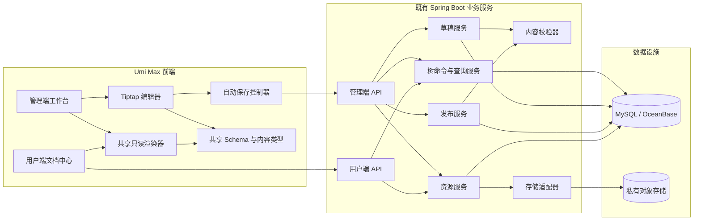
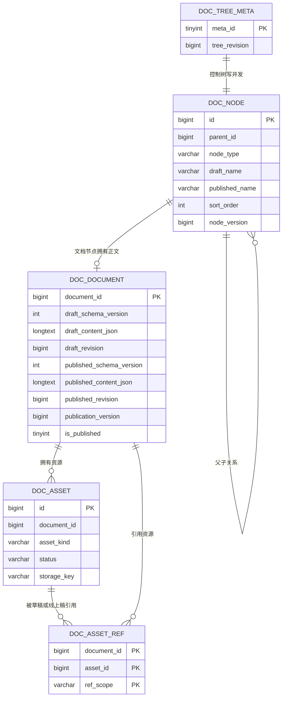
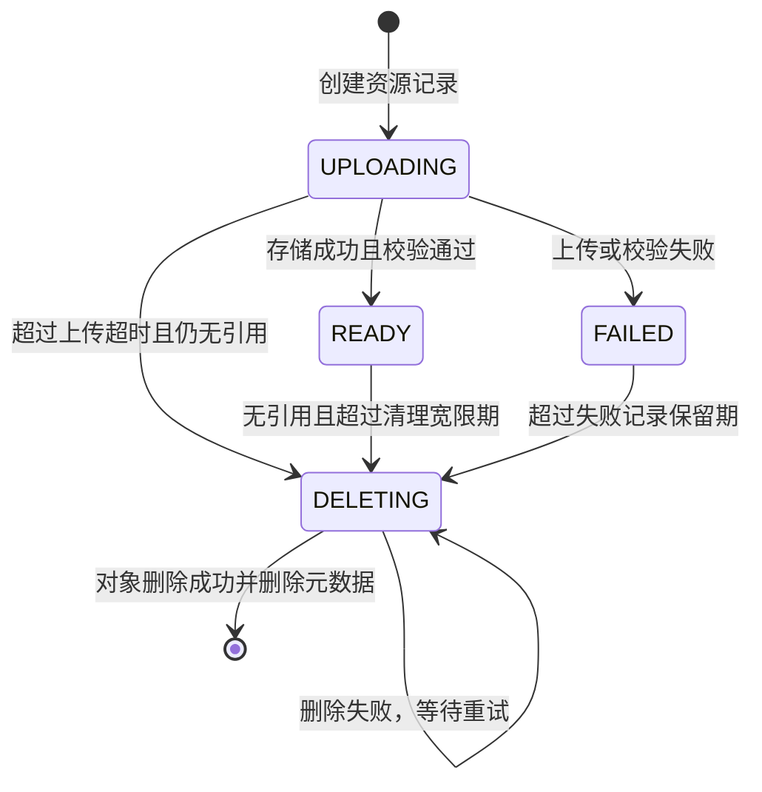
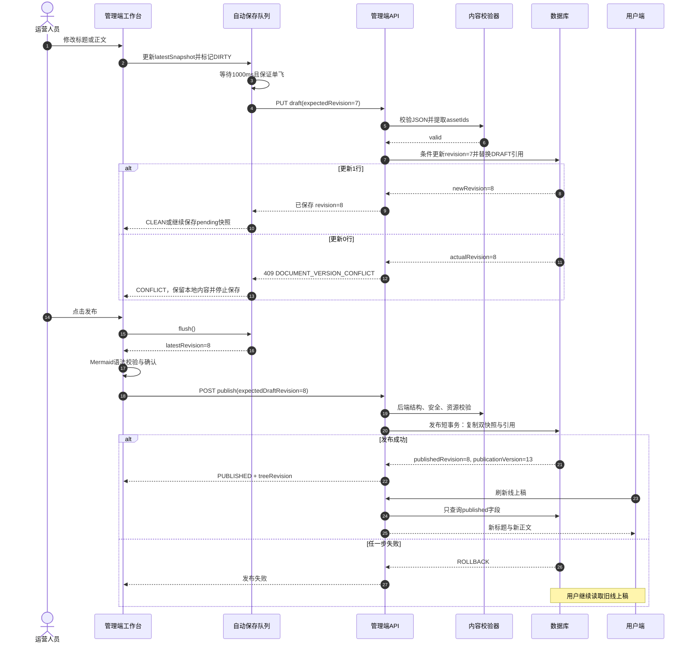
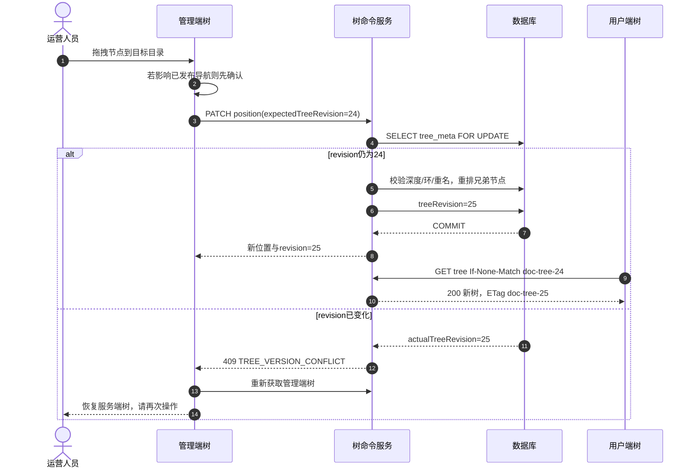
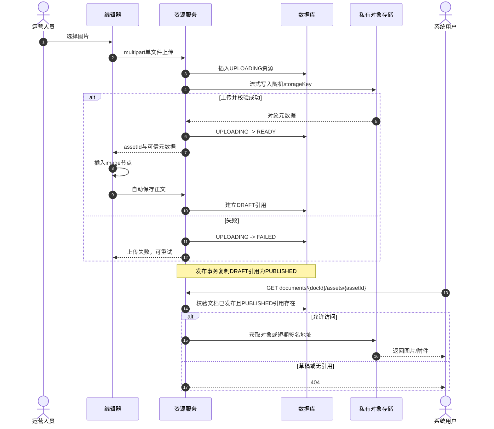

# AI Infra 文档发布中心前后端详细技术设计

> 日期：2026-07-06
> 状态：已完成文档一致性复核与后端项目结构规范对齐；当前按独立参考工程开发策略推进，企业内网迁移适配点后置
> 依据：[产品设计](./2026-06-30-document-publishing-center-design.md)与[前后端技术调研](./2026-07-01-document-publishing-technical-research.md)
> 适用技术栈：Java 11、Spring Boot 2.3.12.RELEASE、MyBatis-Plus 3.5.1、MySQL/OceanBase MySQL 模式、`@umijs/max@4.5.3`、TypeScript 4.9.5、Tailwind CSS 3.4.17、Tiptap 3

## 1. 文档目的

本文把已经确认的产品方案和技术调研结论细化为可开发、可联调、可测试的技术设计，覆盖：

- 系统架构与模块边界。
- 数据库表、索引、约束及状态不变量。
- 后端类职责、事务边界和关键算法。
- 管理端、用户端 API 协议及错误码。
- 前端目录、路由、组件、状态机和内容渲染设计。
- 上传、发布、下架、并发冲突等关键时序。
- 安全、性能、可观测性、测试、上线和回退方案。

本文是实现设计，不重新讨论以下已确认范围：不做多人实时协作、评论、分享、导出、审批、定时发布、历史版本、回滚、全文检索、文档级权限和外部内容嵌入。

## 2. 设计基线与术语

### 2.1 核心术语

| 术语 | 定义 |
|---|---|
| 目录 | 只负责分组、层级、排序和折叠；没有正文和发布状态 |
| 文档 | 唯一发布单元，承载标题、富文本正文和资源引用 |
| 编辑稿 | 运营当前编辑并自动保存的标题与正文 |
| 线上稿 | 当前可被用户端读取的已发布标题与正文 |
| `draftRevision` | 每次成功保存编辑稿后递增的版本号，用于阻止并发覆盖 |
| `publishedRevision` | 当前线上稿对应的 `draftRevision` |
| `publicationVersion` | 每次发布或取消发布都递增的发布实例版本，用于下架并发保护和文档 ETag |
| `treeRevision` | 所有影响树结构或用户端树展示的操作完成后递增的版本号 |
| 资源 | 图片或附件的二进制对象及其元数据 |
| DRAFT/PUBLISHED 引用 | 同一资源分别被编辑稿或线上稿使用的关系 |

### 2.2 不可破坏的设计不变量

1. 用户端查询从 SQL 和 DTO 边界开始就不能出现编辑稿字段。
2. 保存编辑稿永远不会触发发布。
3. 发布在单个数据库事务内同时切换标题、正文、资源引用和发布状态。
4. 对象存储调用不得发生在数据库发布事务中。
5. 已发布文档继续编辑时，用户持续读取旧线上稿。
6. 资源只有存在 PUBLISHED 引用时才能通过用户端接口访问。
7. 文档稳定 URL 仅使用不可变 `documentId`，不使用标题或目录路径。
8. 所有树写操作必须校验 `treeRevision`；所有草稿保存必须校验 `draftRevision`。
9. 管理端预览与用户端阅读共用内容 Schema、只读节点组件和排版样式。
10. 正文的规范存储格式是受控 JSON，不保存 HTML、DOM 或永久资源 URL。
11. Mermaid 完整语法由官方管理端在预览和发布前校验；后端只校验节点结构、大小和安全属性。

### 2.3 默认限制

| 项目 | 默认值 |
|---|---:|
| 目录最大层级 | 4 层 |
| 节点名称长度 | 1～200 个 Unicode 字符 |
| 单篇内容 JSON | 2 MB（UTF-8 字节数） |
| 单篇节点数 | 10,000 |
| JSON 最大嵌套深度 | 100 |
| 单个 Mermaid 源码 | 50 KB |
| 单篇 Mermaid 块数量 | 50 |
| 单个表格 | 100 行 × 30 列 |
| 图片 | JPG、PNG、WebP；单文件 10 MB |
| 附件 | 配置白名单；单文件 50 MB |
| 标题搜索返回数量 | 最多 50 条 |
| 自动保存静默时间 | 默认 1,000 ms，可在 800～1,200 ms 内调整 |
| 中断上传判定 | UPLOADING 持续 60 分钟且无引用 |

## 3. 总体架构



### 3.1 部署边界

- 独立参考工程可采用单后端工程 + 单前端工程组织；迁移到企业系统时，后端代码进入当前承载业务需求的既有 Spring Boot 服务，不新增独立微服务。
- 不为本模块新增 Redis、Kafka、Elasticsearch、WebSocket 或 Node 后端服务。
- 对象存储统一通过 `DocumentObjectStorage` 适配器隔离；独立工程默认使用 MinIO S3 兼容对象存储，迁移到企业系统时替换为 `platform-support-storage-v2`。
- 管理端与用户端在同一 Umi 工程内使用四个独立路由，管理端编辑器依赖不能进入普通用户首屏包。
- 权限在独立工程中只做登录与后台写接口占位；迁移后继续由现有菜单、后台接口权限和登录体系负责，本模块不建立文档级 ACL。

### 3.2 数据流边界

| 数据 | 规范来源 | 可见范围 |
|---|---|---|
| 树结构、目录名和排序 | `doc_node` | 管理端全部可见；用户端只组合已发布文档及其祖先目录 |
| 编辑稿标题 | `doc_node.draft_name` | 仅管理端 |
| 线上标题 | `doc_node.published_name` | 仅已发布文档可被用户端读取 |
| 编辑稿正文 | `doc_document.draft_*` | 仅管理端 |
| 线上正文 | `doc_document.published_*` | 仅 `is_published=1` 时可被用户端读取 |
| 二进制资源 | 私有对象存储 | 通过管理端或用户端受控下载接口访问 |
| 资源元数据与引用 | `doc_asset`、`doc_asset_ref` | 按文档归属和引用范围过滤 |

## 4. 数据库设计

### 4.1 通用约定

- 主键类型使用 `BIGINT`，值由现有系统 ID 生成器生成；不依赖数据库自增。
- 虚拟根节点使用 `parent_id = 0`，数据库中不插入根节点记录。
- 表名以 `doc_` 为逻辑前缀；若现有系统有统一前缀，实施时整体替换。
- 默认不建立物理外键，避免与既有分库、迁移和删除约定冲突；所有关联完整性由服务层和集成测试保证。
- 名称和正文使用 `utf8mb4`。唯一名称键使用二进制排序规则，保证数据库比较与 Java 归一化结果一致。
- 时间字段示例使用 `DATETIME`；最终类型、默认值与审计字段命名继承现有项目基类。
- `node_type`、`asset_kind`、`status`、`ref_scope` 使用字符串码值，不依赖数据库 `ENUM` 或 `CHECK`。

### 4.2 ER 图



### 4.3 `doc_node`

统一保存目录和文档节点。目录的 `draft_name` 与 `published_name` 始终同步；文档的两套名称分别代表管理端标题和线上标题。

```sql
CREATE TABLE doc_node (
    id                  BIGINT       NOT NULL COMMENT '节点ID，文档稳定URL使用该值',
    parent_id           BIGINT       NOT NULL DEFAULT 0 COMMENT '父节点ID，0表示虚拟根',
    node_type           VARCHAR(16)  NOT NULL COMMENT 'DIRECTORY或DOCUMENT',
    draft_name          VARCHAR(200) NOT NULL COMMENT '管理端名称/编辑稿标题',
    draft_name_key      VARCHAR(200) NOT NULL COMMENT '编辑稿名称归一化唯一键',
    published_name      VARCHAR(200) NULL COMMENT '目录公开名称或文档线上标题',
    published_name_key  VARCHAR(200) NULL COMMENT '线上名称归一化唯一键',
    sort_order          INT          NOT NULL COMMENT '同级顺序，按10递增',
    node_version        BIGINT       NOT NULL DEFAULT 1 COMMENT '节点自身更新版本',
    creator_id          BIGINT       NOT NULL,
    create_time          DATETIME     NOT NULL,
    updator_id          BIGINT       NOT NULL,
    update_time          DATETIME     NOT NULL,
    PRIMARY KEY (id),
    UNIQUE KEY uk_doc_node_draft_name (parent_id, draft_name_key),
    UNIQUE KEY uk_doc_node_published_name (parent_id, published_name_key),
    KEY idx_doc_node_parent_sort (parent_id, sort_order, id),
    KEY idx_doc_node_type (node_type)
) ENGINE=InnoDB DEFAULT CHARSET=utf8mb4 COLLATE=utf8mb4_bin COMMENT='文档中心目录与文档节点';
```

名称处理规则由唯一的 `DocumentNameNormalizer` 实现：

1. 使用 Unicode NFKC 归一化。
2. 去除首尾 Unicode 空白；展示名称保留中间空格。
3. 唯一键使用 `Locale.ROOT` 小写。
4. 归一化后为空或超过 200 个 Unicode 字符时拒绝。
5. 前端只做提前提示，后端和唯一索引是最终约束。

`published_name_key` 对未发布文档为 `NULL`。MySQL/OceanBase MySQL 模式的唯一索引允许多行 `NULL`，因此多个未发布文档不会互相冲突。发布、移动已发布文档、目录重命名时，线上名称冲突由服务预检和数据库唯一索引共同拦截。

### 4.4 `doc_document`

一篇文档只保存当前编辑稿与当前线上稿，不保存历史版本。

```sql
CREATE TABLE doc_document (
    document_id               BIGINT    NOT NULL COMMENT '与doc_node.id一一对应',
    draft_schema_version      INT       NOT NULL DEFAULT 1,
    draft_content_json        LONGTEXT  NOT NULL COMMENT '编辑稿Tiptap JSON',
    draft_revision            BIGINT    NOT NULL DEFAULT 1,
    published_schema_version  INT       NULL,
    published_content_json    LONGTEXT  NULL COMMENT '当前线上Tiptap JSON',
    published_revision        BIGINT    NULL COMMENT '线上稿对应的draft_revision',
    publication_version       BIGINT    NOT NULL DEFAULT 0 COMMENT '发布实例版本，发布/取消发布均递增',
    is_published              TINYINT   NOT NULL DEFAULT 0,
    draft_updated_by          BIGINT    NOT NULL,
    draft_updated_at          DATETIME  NOT NULL,
    published_by              BIGINT    NULL COMMENT '最近一次成功发布人',
    published_at              DATETIME  NULL COMMENT '最近一次成功发布时间',
    PRIMARY KEY (document_id),
    KEY idx_doc_document_published (is_published, published_at),
    KEY idx_doc_document_draft_updated (draft_updated_at)
) ENGINE=InnoDB DEFAULT CHARSET=utf8mb4 COLLATE=utf8mb4_bin COMMENT='文档编辑稿与线上稿双快照';
```

状态只按下列公式派生，不增加第三个状态字段：

```text
is_published = 0
  => DRAFT

is_published = 1 AND draft_revision = published_revision
  => PUBLISHED

is_published = 1 AND draft_revision <> published_revision
  => PUBLISHED_WITH_CHANGES
```

发布和取消发布都将 `publication_version` 递增 1。取消发布时清空 `published_schema_version`、`published_content_json`、`published_revision`、`doc_node.published_name` 和 PUBLISHED 资源引用；保留 `published_by/published_at` 作为最近一次成功发布审计。用户查询始终附带 `is_published = 1`，审计字段的保留不能恢复可见性。

### 4.5 `doc_asset`

每个资源只属于一篇文档，MVP 不跨文档复用。

```sql
CREATE TABLE doc_asset (
    id               BIGINT        NOT NULL,
    document_id      BIGINT        NOT NULL,
    asset_kind       VARCHAR(16)   NOT NULL COMMENT 'IMAGE或ATTACHMENT',
    status           VARCHAR(16)   NOT NULL COMMENT 'UPLOADING/READY/FAILED/DELETING',
    storage_key      VARCHAR(512)  NOT NULL COMMENT '服务端生成的私有对象键',
    original_name    VARCHAR(255)  NOT NULL COMMENT '仅用于展示和下载',
    file_extension   VARCHAR(32)   NOT NULL,
    mime_type        VARCHAR(128)  NULL COMMENT '服务端检测后的MIME',
    size_bytes       BIGINT        NULL,
    checksum_alg     VARCHAR(16)   NULL,
    checksum         VARCHAR(128)  NULL,
    failure_code     VARCHAR(64)   NULL,
    ready_at         DATETIME      NULL,
    creator_id       BIGINT        NOT NULL,
    create_time       DATETIME      NOT NULL,
    updator_id       BIGINT        NOT NULL,
    update_time       DATETIME      NOT NULL,
    PRIMARY KEY (id),
    UNIQUE KEY uk_doc_asset_storage_key (storage_key),
    KEY idx_doc_asset_document_status (document_id, status),
    KEY idx_doc_asset_status_updated (status, update_time)
) ENGINE=InnoDB DEFAULT CHARSET=utf8mb4 COLLATE=utf8mb4_bin COMMENT='文档图片与附件元数据';
```

状态转换：



FAILED 记录不会重新回到 UPLOADING。上传重试创建新的资源记录和 `storage_key`，不覆盖旧对象；这样可以避免失败重试与旧请求完成发生竞态。UPLOADING 超过 60 分钟且仍无引用时视为中断上传，由清理任务删除可能已写入的对象。

### 4.6 `doc_asset_ref`

```sql
CREATE TABLE doc_asset_ref (
    document_id  BIGINT       NOT NULL,
    asset_id     BIGINT       NOT NULL,
    ref_scope    VARCHAR(16)  NOT NULL COMMENT 'DRAFT或PUBLISHED',
    create_time   DATETIME     NOT NULL,
    PRIMARY KEY (document_id, asset_id, ref_scope),
    KEY idx_doc_asset_ref_asset (asset_id, ref_scope)
) ENGINE=InnoDB DEFAULT CHARSET=utf8mb4 COLLATE=utf8mb4_bin COMMENT='编辑稿与线上稿资源引用';
```

保存草稿时，后端从正文 JSON 中提取 `assetId`，在同一事务内替换该文档全部 DRAFT 引用。客户端不单独提交可信的资源列表，避免正文与资源清单不一致。

发布时执行 `DELETE PUBLISHED` 后再通过 `INSERT ... SELECT` 复制 DRAFT 引用。草稿删除一张仍被线上稿引用的图片时，PUBLISHED 引用仍然存在，对象不会被提前清理。

### 4.7 `doc_tree_meta`

```sql
CREATE TABLE doc_tree_meta (
    meta_id         TINYINT   NOT NULL,
    tree_revision   BIGINT    NOT NULL,
    updator_id      BIGINT    NOT NULL,
    update_time      DATETIME  NOT NULL,
    PRIMARY KEY (meta_id)
) ENGINE=InnoDB DEFAULT CHARSET=utf8mb4 COLLATE=utf8mb4_bin COMMENT='文档树全局修订号';

INSERT INTO doc_tree_meta(meta_id, tree_revision, updator_id, update_time)
VALUES (1, 1, 0, NOW());
```

下列操作必须在事务中锁定 `meta_id=1` 并递增 `tree_revision`：

- 新建或删除目录、文档。
- 目录重命名。
- 节点移动或同级排序。
- 首次发布、发布更新、取消发布。

草稿正文或草稿标题保存不递增 `tree_revision`，避免运营 A 编辑正文导致运营 B 的树拖拽无意义冲突。当前编辑页面根据保存响应即时更新本地树标题和状态；其他管理端页面通过重新获取树看到最新草稿信息。用户端树的所有可见变化都会触发 `tree_revision`，因此它可以作为用户树 ETag。

### 4.8 初始化与迁移脚本要求

- 建表脚本和回退脚本进入现有数据库迁移体系，不允许应用启动时自动建表。
- 上线脚本先建五张空表并插入 `doc_tree_meta` 单行，再发布应用和菜单。
- 回退应用时保留表和数据；除非经过人工备份确认，不执行自动 `DROP TABLE`。
- 若生产库是 OceanBase，需在预发布环境验证 `LONGTEXT`、`utf8mb4_bin`、唯一索引多 `NULL`、事务隔离和 `INSERT ... SELECT` 行为。

## 5. 内容 JSON 协议

### 5.1 传输与存储结构

API 把 Schema 版本与 Tiptap 文档分开传输：

```json
{
  "schemaVersion": 1,
  "content": {
    "type": "doc",
    "content": [
      {
        "type": "paragraph",
        "content": [{ "type": "text", "text": "示例正文" }]
      }
    ]
  }
}
```

数据库为编辑稿和线上稿分别保存 `draft/published_schema_version` 与对应的 `draft/published_content_json`。前端调用 `editor.getJSON()` 得到 `content`；不把编辑器实例、HTML 或 React 属性写入请求。

### 5.2 允许的节点与标记

| 类型 | 允许属性/子节点 | 额外约束 |
|---|---|---|
| `doc` | block 节点 | 必须为根且只能出现一次 |
| `paragraph` | inline 内容 | 无任意属性 |
| `heading` | inline 内容；`level` | `level` 仅 1、2、3；TOC 只取 2、3 |
| `text` | `text`、marks | 单文本节点长度受总量约束 |
| `bulletList`/`orderedList` | `listItem` | 有序列表起始值 1～9999 |
| `listItem` | paragraph/list | 限制递归深度 |
| `blockquote` | block | 无任意样式 |
| `horizontalRule`/`hardBreak` | 无 | 无属性 |
| `table` | row/header/cell | 最大 100 × 30，不允许脚本属性 |
| `codeBlock` | text；`language` | 语言必须在固定白名单，未知值转 `plaintext` |
| `image` | `assetId`、`alt`、`caption`、`align` | 资源属于当前文档且为 READY IMAGE |
| `attachment` | `assetId` | 名称、MIME、大小以服务端元数据为准 |
| `callout` | block；`kind` | `info/warning/error/tip` |
| `mermaid` | `source` | UTF-8 不超过 50 KB，不允许配置覆盖安全参数 |

允许的 marks：`bold`、`italic`、`strike`、`underline`、`code`、`link`。`link.href` 只允许 `http`、`https` 或系统内以 `/` 开头的相对路径；渲染层自行决定 `target` 和 `rel`，正文不能覆盖。

明确禁止：HTML 节点、`style`、CSS class、事件属性、iframe、script、SVG 源码、任意 `data:` URL、永久对象存储 URL和未知节点属性。

### 5.3 Markdown 直接粘贴

支持运营把 Markdown 文本直接粘贴进编辑器，但 Markdown 只是输入方式，保存结果仍为受控 JSON：

- 剪贴板包含可信编辑器生成的 `text/html` 时，优先走 Tiptap 标准粘贴管线。
- 只有 `text/plain` 且检测到多行 Markdown 强特征时才执行 Markdown 转换；普通单行 `#`、`-` 不应误转换。
- 首期支持标题、段落、粗体、斜体、删除线、链接、引用、列表、分隔线、围栏代码块和表格。
- ```` ```mermaid ```` 围栏转换为 `mermaid` 节点；其他围栏转换为 `codeBlock`。
- Markdown 图片外链不自动下载或转为内部图片；保留为普通链接并提示运营通过上传能力插入图片。
- 原始 HTML、iframe 和不受支持的 Markdown 扩展按纯文本处理。
- 粘贴转换必须加入 JSON round-trip Fixture，确保保存后重新打开不丢结构。

### 5.4 后端校验输出

`DocumentContentValidator` 返回结构化问题列表：

```json
{
  "issues": [
    {
      "path": "/content/4/attrs/source",
      "code": "MERMAID_SOURCE_TOO_LARGE",
      "message": "第 5 个内容块的 Mermaid 源码超过 50KB"
    }
  ],
  "assetIds": ["1912345678901234567"]
}
```

Java 后端不解析完整 Mermaid 语法。官方管理端在预览和发布前使用同版本 Mermaid 解析器权威阻止语法错误；后端强制校验节点结构、源码大小、资源归属和安全属性。阅读端仍捕获单块渲染错误。若未来存在第三方写 API，再单独引入服务端 Mermaid 校验能力，不能假设浏览器校验可约束第三方调用方。

### 5.5 Java 校验实现顺序

草稿保存请求不能先由 Spring MVC 默认 Jackson Converter 反序列化，再进入 `DocumentContentValidator`，否则大小和深度限制已经晚于全局解析。为 `SaveDraftRequest` 注册优先级高于默认 Jackson Converter 的 `DocumentSaveRequestHttpMessageConverter`，并按固定顺序处理：

1. 根据 `Content-Length` 提前拒绝明显超限请求；无该请求头时仍继续流式计数。
2. 使用计数输入流读取请求，整个请求上限为“2 MB 正文 + 64 KB 标题与协议开销”，超过时返回 `CONTENT_TOO_LARGE`。
3. 使用文档模块专用的 Jackson `JsonFactory/ObjectMapper` 把完整请求解析为 `SaveDraftRequest`。
4. 专用 Mapper 配置 `StreamReadConstraints`，限制嵌套深度、字符串长度和数字长度；不能修改全局 Mapper 影响既有接口。
5. Converter 返回 DTO 后继续执行 `@Valid`；随后校验 `content` 自身 UTF-8 字节数不超过 2 MB。
6. 校验 `schemaVersion`，递归遍历节点和 marks，累计节点数并按 JSON Pointer 记录问题。
7. 提取去重后的 `assetId` 集合，再批量查询资源归属和状态，禁止逐节点查数据库。
8. 把规范化 JSON 字符串、问题列表和资源 ID 集合返回给应用服务。

本模块只使用项目统一 Jackson 2.15.2 依赖，不单独覆盖版本，不使用父 POM 中可能存在的 Fastjson 1.x 解析不可信正文。编码前必须通过目标模块的有效依赖树确认 `jackson-core`、`databind`、`annotations` 和 JSR-310 模块版本一致。

### 5.6 Schema 演进

MVP 只写入 `schemaVersion=1`，但读取器按版本注册：

```ts
const readers = {
  1: renderV1,
} satisfies Record<number, ContentReader>;

const editorMigrators = {
  1: migrateV1ToCurrent,
} satisfies Record<number, ContentMigrator>;
```

未来升级步骤必须是：先发布能读取旧版和新版的 Reader/后端校验器，再允许编辑器写新版本。打开旧编辑稿时在前端内存迁移，下一次明确保存后才写入新版；旧线上稿保持原 Schema 并由兼容 Reader 读取，直到运营再次发布。禁止在没有回滚能力的情况下对全部正文执行不可逆批量更新。

## 6. 后端详细设计

### 6.1 建议包结构

独立参考工程先按目标企业规范组织包结构，不新增不必要的顶层 Maven module。根包建议使用 `com.xxx.pai.mlp.man.documentcenter`；后续迁移到企业仓库时，若已有同义模块名，以既有命名为准。分层遵循 `client/application/domain/infra`。本文按常规拼写使用 `client`；若企业仓库历史上实际使用 `clinet` 目录名，迁移时沿用现状，不新建并行目录。

```text
com.xxx.pai.mlp.man.documentcenter/
  client/
    controller/
      DocumentAdminController.java
      DocumentController.java
      DocumentAssetController.java
    dto/
      DirectoryDTO.java
      DocumentDTO.java
      DocumentDraftDTO.java
      DocumentPublishDTO.java
      DocumentAssetDTO.java
    vo/
      DocumentTreeVO.java
      AdminDocumentDetailVO.java
      PublishedDocumentDetailVO.java
      DocumentAssetVO.java
      DocumentOperationVO.java
    service/
      DocumentClientService.java
  application/
    DocumentTreeService.java
    DocumentTreeServiceImpl.java
    DocumentDraftService.java
    DocumentDraftServiceImpl.java
    DocumentPublishService.java
    DocumentPublishServiceImpl.java
    DocumentAssetService.java
    DocumentAssetServiceImpl.java
    PublishedDocumentQueryService.java
    PublishedDocumentQueryServiceImpl.java
    DocumentAssetCleanupJob.java
  domain/
    ability/
      DocumentContentAbility.java
      DocumentNameAbility.java
      DocumentTreeAbility.java
      DocumentPublishAbility.java
      DocumentAssetAbility.java
    bo/
      DocumentContentBO.java
      ContentValidationResultBO.java
      DocumentPublishStateBO.java
      DocumentTreeNodeBO.java
      DocumentAssetBO.java
    po/
      DocumentNodePO.java
      DocumentPO.java
      DocumentAssetPO.java
      DocumentAssetRefPO.java
      DocumentTreeMetaPO.java
    repository/
      DocumentNodeMapper.java
      DocumentMapper.java
      DocumentAssetMapper.java
      DocumentAssetRefMapper.java
      DocumentTreeMetaMapper.java
      DocumentQueryMapper.java
  infra/
    config/
      DocumentCenterConfig.java
    web/
      DocumentSaveRequestHttpMessageConverter.java
    storage/
      DocumentObjectStorage.java
      PlatformStorageV2Adapter.java
    convert/
      DocumentAdminConverter.java
      PublishedDocumentConverter.java
    exception/
      DocumentErrorCode.java
      DocumentBusinessException.java
    util/
      DocumentJsonUtils.java
```

分层原则：

- `client` 承载 Controller、DTO、VO 和对外服务契约。Controller 命名采用 `{Domain}Controller.java`；管理端和用户端可以通过 `DocumentAdminController` 与 `DocumentController` 分开，避免同一接口类混合草稿与线上语义。
- `application` 承载业务编排。Service 命名采用 `{Domain}Service.java` / `{Domain}ServiceImpl.java`；事务只放在可被 Spring 代理调用的 Application Service 公共方法上。
- `domain/ability` 承载无 IO 领域能力，例如名称归一化、树规则、内容校验、发布状态计算和资源策略。
- `domain/bo` 承载业务对象，不直接绑定 HTTP 或数据库。
- `domain/po` 承载持久化对象。PO 命名采用 `{Domain}PO.java`，不得作为接口 VO 直接返回。
- `domain/repository` 承载 MyBatis Mapper。Mapper 命名采用 `{Domain}Mapper.java`，Mapper XML 与接口同名；简单 CRUD 可以继承 MyBatis-Plus `BaseMapper`，关键路径使用显式 XML SQL。
- `infra` 隔离平台实现细节，包括配置、专用 `HttpMessageConverter`、存储 SDK 适配、Converter、异常映射和工具类。
- 管理端 DTO/VO 与用户端 DTO/VO 完全分开；禁止从同一 PO 自动映射后再清空草稿字段。

Spring Boot 2.3 使用 `javax.validation.*`、`javax.servlet.*` 和现有 Swagger 2/Knife4j 注解；不引入 Spring Boot 3 的 `jakarta.*` 或 `ProblemDetail`。

### 6.2 核心服务接口

```java
public interface DocumentTreeService {
    AdminTreeResult getAdminTree();
    PublishedTreeResult getPublishedTree();
    NodeMutationResult createDirectory(CreateDirectoryCommand command);
    NodeMutationResult createDocument(CreateDocumentCommand command);
    NodeMutationResult renameDirectory(RenameDirectoryCommand command);
    NodeMutationResult moveNode(MoveNodeCommand command);
    NodeMutationResult deleteNode(DeleteNodeCommand command);
}

public interface DocumentDraftService {
    AdminDocumentDetail getDraft(long documentId);
    DraftSaveResult saveDraft(SaveDraftCommand command);
}

public interface DocumentPublishService {
    PublishResult publish(PublishDocumentCommand command);
    UnpublishResult unpublish(UnpublishDocumentCommand command);
}

public interface DocumentAssetService {
    AssetUploadResult upload(UploadAssetCommand command, InputStream inputStream);
    AssetDownload openAdminAsset(long documentId, long assetId);
    AssetDownload openPublishedAsset(long documentId, long assetId);
}

public interface PublishedDocumentQueryService {
    PublishedDocumentDetail getPublishedDocument(long documentId);
    List<PublishedSearchItem> searchByTitle(String keyword, int limit);
}

public interface DocumentObjectStorage {
    StoredObject put(String storageKey, InputStream stream, long declaredSize, String contentType);
    ObjectStream get(String storageKey);
    void delete(String storageKey);
}
```

命令对象必须携带当前用户和版本信息，不从 Controller 的可变线程上下文隐式读取业务参数；操作者 ID 可由应用服务调用平台身份组件填入。

### 6.3 Mapper 使用边界

| 场景 | 实现方式 |
|---|---|
| 按主键读取、插入单实体 | MyBatis-Plus `BaseMapper` |
| 简单状态过滤 | `LambdaQueryWrapper` |
| 管理端树、用户端树、详情组合查询 | 显式 Mapper XML 与 `resultMap` |
| `draftRevision` 条件保存 | 固定 XML `UPDATE`，根据影响行数判断冲突 |
| 发布快照复制 | 固定 XML SQL |
| DRAFT/PUBLISHED 引用替换 | 固定 XML `DELETE` + 批量 `INSERT`/`INSERT ... SELECT` |
| 树兄弟节点批量重排 | 固定 XML 批量更新 |

`draft_revision` 不使用 MyBatis-Plus `@Version`，防止乐观锁插件与显式 `expectedDraftRevision` 重复改写 SQL。若目标服务已注册 PageHelper 或 MyBatis-Plus 分页插件，本模块树与标题搜索均不走分页拦截器。

### 6.4 树读取算法

管理端树一次读取全部节点和文档状态。用户端树一次读取：

1. 全部目录节点。
2. `is_published = 1` 的文档节点及线上标题。
3. 当前 `tree_revision`。
4. 在 Java 内按 `parent_id` 分组并按 `sort_order,id` 排序。
5. 用户树自底向上移除没有已发布文档后代的目录。
6. 深度优先展开文档节点，第一项作为 `defaultDocumentId`，同时供前后篇导航使用。

树查询应通过一条组合查询或同一个只读事务获得一致快照。树规模约 30 篇，不使用递归 CTE、N+1 查询、虚拟滚动或缓存。

服务端仍要处理脏数据防御：遇到孤儿节点、环或超过四层时记录错误日志并跳过异常分支，不让整个文档中心白屏；管理端同时返回 `TREE_DATA_CORRUPTED`，要求修复数据。

### 6.5 树写事务

所有树写操作采用同一模板：

```text
BEGIN
  SELECT tree_revision FROM doc_tree_meta WHERE meta_id = 1 FOR UPDATE
  compare actualTreeRevision with expectedTreeRevision
  load source node, target parent, source siblings, target siblings
  validate node type, target type, depth, cycle and both name timelines
  apply mutation
  normalize affected sibling sort_order to 10,20,30...
  UPDATE doc_tree_meta SET tree_revision = tree_revision + 1
COMMIT
```

具体规则：

- 目标父节点必须是目录或虚拟根。
- 目录不能移动到自身或任一后代。
- “四层”只计算目录层级；第四层目录下可以放文档，不能再放子目录。
- 移动目录时必须计算整个子树移动后的最大目录深度。
- `targetIndex` 按移除源节点后的目标兄弟数组解释，范围为 `0..size`。
- 源父与目标父相同时只重排一次。
- 移动已发布文档时同时验证草稿标题和线上标题在目标目录都不重名。
- 目录重命名同时修改 `draft_name` 与 `published_name`；它可能因任一时间线重名而失败。
- 非空目录删除返回 `DIRECTORY_NOT_EMPTY`。
- `is_published = 1` 的文档删除返回 `PUBLISHED_DOCUMENT_CANNOT_DELETE`。
- 删除草稿文档时删除节点、正文和资源引用；资源元数据交给异步清理任务处理。

### 6.6 新建文档事务

新建文档在一个事务内完成：

1. 锁定并校验 `treeRevision`。
2. 归一化标题并校验同级草稿名称唯一。
3. 插入 `doc_node`，`published_name` 为空。
4. 插入 `doc_document`，初始内容为 `{"type":"doc","content":[]}`，`draftRevision=1`。
5. 归一化目标目录排序。
6. 递增 `treeRevision`。

任何一步失败都不能留下只有节点、没有正文的半成品。

### 6.7 草稿保存事务

内容 JSON 的字节数、解析、节点结构和大部分资源 ID 提取在开启事务前完成，缩短事务时间。事务内执行：

```sql
UPDATE doc_node
SET draft_name = #{draftTitle},
    draft_name_key = #{draftTitleKey},
    node_version = node_version + 1,
    updator_id = #{operatorId},
    update_time = #{now}
WHERE id = #{documentId}
  AND node_type = 'DOCUMENT';

UPDATE doc_document
SET draft_schema_version = #{schemaVersion},
    draft_content_json = #{contentJson},
    draft_revision = draft_revision + 1,
    draft_updated_by = #{operatorId},
    draft_updated_at = #{now}
WHERE document_id = #{documentId}
  AND draft_revision = #{expectedDraftRevision};
```

完整顺序：

1. 确认所有提取出的资源属于当前文档且状态为 READY。
2. 更新草稿标题。
3. 条件更新正文；影响 0 行时抛出异常，使标题更新回滚。
4. 删除旧 DRAFT 引用。
5. 批量插入新 DRAFT 引用。
6. 提交并返回 `expectedDraftRevision + 1`。

若正文条件更新为 0 行，再执行一次只读查询：文档不存在返回 404；实际 revision 不同返回 `DOCUMENT_VERSION_CONFLICT`。唯一索引冲突根据索引名转换为 `DUPLICATE_DRAFT_NAME`，不得把数据库异常原文返回给前端。

### 6.8 发布事务

发布前，前端先完成自动保存 flush 和 Mermaid 语法校验。后端先在事务外解析并校验草稿内容，再执行：

```text
BEGIN
  lock doc_tree_meta row
  select document + node for update
  assert draft_revision = expectedDraftRevision
  assert all DRAFT assets belong to document and are READY
  assert draft title can be used as published title under current parent
  copy draft title to published title
  copy draft schema/content/revision to published fields
  delete old PUBLISHED refs
  insert PUBLISHED refs from DRAFT refs
  set is_published=1, published_by, published_at and increment publication_version
  increment tree_revision
COMMIT
```

快照复制必须在数据库内使用列到列更新，不能先读到 Java 后再写回：

```sql
UPDATE doc_document
SET published_schema_version = draft_schema_version,
    published_content_json = draft_content_json,
    published_revision = draft_revision,
    publication_version = publication_version + 1,
    is_published = 1,
    published_by = #{operatorId},
    published_at = #{now}
WHERE document_id = #{documentId}
  AND draft_revision = #{expectedDraftRevision};
```

若任何 SQL、唯一约束或资源校验失败，事务整体回滚，旧线上标题、正文和资源引用继续有效。发布事务内禁止调用对象存储、Mermaid、HTTP 或消息队列。

### 6.9 取消发布事务

请求携带页面所见的 `expectedPublicationVersion`。事务内：

1. 锁定 `doc_tree_meta` 和文档行。
2. 校验文档当前已发布且 `publication_version` 与请求一致；不能只比较可能在下架重发后重复的 `published_revision`。
3. 清空线上标题、线上内容、线上 Schema、线上 revision。
4. 设置 `is_published=0`，保留编辑稿和最近发布审计。
5. 删除 PUBLISHED 引用。
6. 将 `publication_version` 和 `treeRevision` 各递增 1。

重复取消发布且文档当前仍未发布时返回成功和 `alreadyUnpublished=true`。如果文档已被重新发布且页面 `expectedPublicationVersion` 已过期，则返回 `DOCUMENT_PUBLICATION_CONFLICT`，防止旧页面静默下架新的发布实例。

### 6.10 资源上传与访问

MVP 采用后端代理的单文件流式上传，避免把预签名协议暴露为必须能力：

1. Controller 校验文档、权限、声明类型和请求大小。
2. 在短事务内插入 UPLOADING 记录和服务端随机 `storage_key`。
3. 事务外通过 `MultipartFile.getInputStream()` 流式写入存储适配器；禁止 `getBytes()`。
4. 根据文件签名、实际大小、MIME 和存储结果校验。
5. 成功时条件更新 `UPLOADING -> READY`；失败时更新为 FAILED。
6. 返回 `assetId` 和服务端可信元数据，编辑器再插入资源节点。

Spring 配置至少满足：

```yaml
spring:
  servlet:
    multipart:
      max-file-size: 50MB
      max-request-size: 52MB
```

网关和反向代理的大小、超时必须同步配置。图片仍由业务校验限制为 10 MB，不能因为 multipart 上限为 50 MB 就放宽。

访问策略：

- 管理端：校验管理权限、`document_id` 归属和资源非 DELETING，可读取草稿资源。
- 用户端：校验文档当前已发布，并存在 `(documentId, assetId, PUBLISHED)` 引用。
- 图片响应使用受控 `Content-Type` 和 `Content-Disposition: inline`。
- 附件使用 `Content-Disposition: attachment; filename*=UTF-8''...`。
- 所有响应设置 `X-Content-Type-Options: nosniff`；原始文件名不得进入响应头而未编码。
- 存储支持短期签名 URL 时可返回 302；否则由后端流式代理。两种方式都必须先经过相同授权校验。

### 6.11 资源清理任务

使用现有定时任务框架；若目标服务没有统一调度能力，可使用单实例 Spring 调度并配合数据库条件更新抢占。默认每小时执行：

```text
candidate = (READY/FAILED assets with no reference and older than gracePeriod(24h))
            OR
            (UPLOADING assets with no reference and older than uploadTimeout(60min))

for each candidate:
  conditional update status to DELETING
  delete object outside transaction
  if success: delete doc_asset row
  if failure: keep DELETING and record retryable failure
```

超时 UPLOADING 可能处于“对象已经写入、READY 状态尚未落库”或“对象从未写入”两种情况，均先通过条件更新抢占为 DELETING，再尝试删除对象；对象不存在按成功处理。DELETING 状态超过重试间隔后可以再次删除。任务必须限制单批数量和执行时长，不记录预签名 URL 或正文。

### 6.12 事务与异常注意事项

- `@Transactional` 放在可被 Spring 代理调用的 Application Service 公共方法上，避免同类内部调用绕过代理。
- 统一使用现有事务管理器；Mapper 不手工 `commit` 或 `rollback`。
- 对业务受检异常若存在，显式配置 `rollbackFor = Exception.class`；更推荐统一继承运行时业务异常。
- 解析 2 MB JSON、文件上传和对象下载均在数据库事务外完成。
- 唯一索引是并发下的最终保护，应用层预检只负责返回更友好的错误。
- 不把完整正文、原始上传流、存储签名 URL写入日志。

## 7. 前后端接口通用协议

### 7.1 路径与响应包裹

后端接口遵循现有项目规范：RESTful 风格统一放在 `/api/v1/{resource}` 下，文档中心资源名为 `document-center`。示例使用：

```text
管理端：/api/v1/document-center/admin
用户端：/api/v1/document-center
```

所有响应统一包裹为 `CommonResponse<T>`，不在本模块新建第二套响应结构。本文用以下逻辑结构表达字段；接入时以真实 `CommonResponse<T>` 字段为准，不改变 `data` 的业务结构：

```ts
interface CommonResponse<T> {
  code: string;
  message: string;
  data: T;
  requestId?: string;
}
```

所有数据库 `BIGINT` ID 和 revision 在 JSON 中序列化为十进制字符串，避免 JavaScript 超过 `Number.MAX_SAFE_INTEGER` 后丢精度。时间统一返回带时区的 ISO 8601 字符串，例如 `2026-07-06T14:30:00+08:00`。

### 7.2 通用节点类型

```ts
type NodeId = string;
type Revision = string;

interface DirectoryTreeNode<TDocument> {
  nodeId: NodeId;
  parentId: NodeId | "0";
  nodeType: "DIRECTORY";
  name: string;
  sortOrder: number;
  children: Array<DirectoryTreeNode<TDocument> | TDocument>;
}

interface AdminDocumentTreeNode {
  nodeId: NodeId;
  parentId: NodeId | "0";
  nodeType: "DOCUMENT";
  draftTitle: string;
  publishedTitle: string | null;
  publishState: "DRAFT" | "PUBLISHED" | "PUBLISHED_WITH_CHANGES";
  sortOrder: number;
}

interface PublishedDocumentTreeNode {
  nodeId: NodeId;
  parentId: NodeId | "0";
  nodeType: "DOCUMENT";
  title: string;
  publishedRevision: Revision;
  sortOrder: number;
}

type AdminTreeNode =
  | DirectoryTreeNode<AdminDocumentTreeNode>
  | AdminDocumentTreeNode;

type PublishedTreeNode =
  | DirectoryTreeNode<PublishedDocumentTreeNode>
  | PublishedDocumentTreeNode;
```

API 默认返回嵌套 `children` 树，便于前端直接渲染；服务内部仍以扁平节点构树。30 篇规模下响应体可控。

### 7.3 幂等与并发约定

- GET 请求天然只读。
- 草稿保存、发布、取消发布和树写使用 expected revision 保证重复或过期请求不会覆盖新数据。
- 上传每次生成新 `assetId`，网络重试不能复用不确定状态的上传请求；前端根据返回结果决定是否重试。
- 创建目录/文档不额外引入幂等键。前端提交期间禁用按钮；重复创建若名称相同由唯一约束拦截。
- `409` 必须由页面业务逻辑处理，不能被全局 request 拦截器转换成普通 toast 后吞掉。

## 8. 管理端 API

### 8.1 接口总表

| 方法 | 路径 | 用途 |
|---|---|---|
| GET | `/api/v1/document-center/admin/tree` | 获取全部目录、文档和 `treeRevision` |
| POST | `/api/v1/document-center/admin/directories` | 新建目录 |
| POST | `/api/v1/document-center/admin/documents` | 新建草稿文档 |
| PATCH | `/api/v1/document-center/admin/directories/{directoryId}` | 重命名目录 |
| PATCH | `/api/v1/document-center/admin/nodes/{nodeId}/position` | 移动或排序节点 |
| DELETE | `/api/v1/document-center/admin/nodes/{nodeId}` | 删除空目录或未发布文档 |
| GET | `/api/v1/document-center/admin/documents/{documentId}` | 获取编辑稿详情 |
| PUT | `/api/v1/document-center/admin/documents/{documentId}/draft` | 条件保存编辑稿 |
| POST | `/api/v1/document-center/admin/documents/{documentId}/publish` | 发布当前编辑稿 |
| POST | `/api/v1/document-center/admin/documents/{documentId}/unpublish` | 携带 expectedPublicationVersion 取消发布 |
| POST | `/api/v1/document-center/admin/documents/{documentId}/assets` | 上传单个图片或附件 |
| GET | `/api/v1/document-center/admin/documents/{documentId}/assets/{assetId}` | 管理端读取资源 |

### 8.2 获取管理端树

```http
GET /api/v1/document-center/admin/tree
```

```json
{
  "code": "0",
  "message": "success",
  "data": {
    "treeRevision": "18",
    "nodes": [
      {
        "nodeId": "19001",
        "parentId": "0",
        "nodeType": "DIRECTORY",
        "name": "模型服务",
        "sortOrder": 10,
        "children": [
          {
            "nodeId": "19002",
            "parentId": "19001",
            "nodeType": "DOCUMENT",
            "draftTitle": "快速接入指南",
            "publishedTitle": "接入指南",
            "publishState": "PUBLISHED_WITH_CHANGES",
            "sortOrder": 10
          }
        ]
      }
    ]
  }
}
```

响应头：`Cache-Control: private, no-cache`。管理端树不使用 ETag，因为草稿标题和待发布状态不会递增 `treeRevision`。

### 8.3 新建目录

```http
POST /api/v1/document-center/admin/directories
Content-Type: application/json
```

```json
{
  "parentId": "0",
  "name": "模型服务",
  "targetIndex": 0,
  "expectedTreeRevision": "18"
}
```

成功返回 `201`：

```json
{
  "code": "0",
  "message": "success",
  "data": {
    "nodeId": "19001",
    "treeRevision": "19"
  }
}
```

### 8.4 新建文档

```http
POST /api/v1/document-center/admin/documents
```

```json
{
  "parentId": "19001",
  "title": "快速接入指南",
  "targetIndex": 0,
  "expectedTreeRevision": "19"
}
```

成功返回 `201`：

```json
{
  "code": "0",
  "message": "success",
  "data": {
    "documentId": "19002",
    "draftRevision": "1",
    "treeRevision": "20"
  }
}
```

### 8.5 重命名目录

```http
PATCH /api/v1/document-center/admin/directories/19001
```

```json
{
  "name": "推理服务",
  "expectedTreeRevision": "20"
}
```

成功响应包含新的 `treeRevision`。目录名称对用户端立即生效，因此前端确认文案必须明确这一点。

### 8.6 移动或排序

```http
PATCH /api/v1/document-center/admin/nodes/19002/position
```

```json
{
  "targetParentId": "19010",
  "targetIndex": 2,
  "expectedTreeRevision": "20"
}
```

```json
{
  "code": "0",
  "message": "success",
  "data": {
    "nodeId": "19002",
    "parentId": "19010",
    "sortOrder": 30,
    "treeRevision": "21",
    "publishedNavigationChanged": true
  }
}
```

移动已发布文档、包含已发布后代的目录或任何目录重命名都可能让用户端导航立即变化。

### 8.7 删除节点

```http
DELETE /api/v1/document-center/admin/nodes/19002?expectedTreeRevision=21
```

成功返回：

```json
{
  "code": "0",
  "message": "success",
  "data": { "treeRevision": "22" }
}
```

已发布文档返回 `409 PUBLISHED_DOCUMENT_CANNOT_DELETE`；非空目录返回 `409 DIRECTORY_NOT_EMPTY`。

### 8.8 获取编辑稿详情

```http
GET /api/v1/document-center/admin/documents/19002
```

```json
{
  "code": "0",
  "message": "success",
  "data": {
    "documentId": "19002",
    "parentId": "19010",
    "draftTitle": "快速接入指南",
    "schemaVersion": 1,
    "content": { "type": "doc", "content": [] },
    "draftRevision": "7",
    "publishState": "PUBLISHED_WITH_CHANGES",
    "publishedTitle": "接入指南",
    "publishedRevision": "5",
    "publicationVersion": "12",
    "publishedAt": "2026-07-06T14:30:00+08:00",
    "draftUpdatedAt": "2026-07-06T15:10:00+08:00",
    "assets": {
      "19100": {
        "assetId": "19100",
        "assetKind": "IMAGE",
        "fileName": "architecture.png",
        "mimeType": "image/png",
        "sizeBytes": "236812",
        "status": "READY"
      }
    }
  }
}
```

`assets` 只返回当前编辑稿正文引用的资源；不得返回未引用资源、存储键和签名 URL。刚上传的资源直接使用上传响应插入编辑器，保存成功后才会在后续详情响应中出现。

### 8.9 保存编辑稿

```http
PUT /api/v1/document-center/admin/documents/19002/draft
```

```json
{
  "expectedDraftRevision": "7",
  "draftTitle": "快速接入指南",
  "schemaVersion": 1,
  "content": {
    "type": "doc",
    "content": [
      {
        "type": "heading",
        "attrs": { "level": 2 },
        "content": [{ "type": "text", "text": "准备工作" }]
      }
    ]
  }
}
```

成功：

```json
{
  "code": "0",
  "message": "success",
  "data": {
    "draftRevision": "8",
    "publishState": "PUBLISHED_WITH_CHANGES",
    "savedAt": "2026-07-06T15:12:10+08:00"
  }
}
```

冲突：

```json
{
  "code": "DOCUMENT_VERSION_CONFLICT",
  "message": "文档已被其他运营人员更新，请复制当前内容后刷新",
  "data": {
    "expectedDraftRevision": "7",
    "actualDraftRevision": "8"
  },
  "requestId": "..."
}
```

前端收到该 `409` 后必须停止自动保存，不能自动用服务端内容覆盖本地编辑器。

### 8.10 发布

```http
POST /api/v1/document-center/admin/documents/19002/publish
```

```json
{ "expectedDraftRevision": "8" }
```

```json
{
  "code": "0",
  "message": "success",
  "data": {
    "publishState": "PUBLISHED",
    "publishedRevision": "8",
    "publicationVersion": "13",
    "publishedAt": "2026-07-06T15:15:00+08:00",
    "treeRevision": "23"
  }
}
```

### 8.11 取消发布

```http
POST /api/v1/document-center/admin/documents/19002/unpublish
```

```json
{ "expectedPublicationVersion": "13" }
```

```json
{
  "code": "0",
  "message": "success",
  "data": {
    "publishState": "DRAFT",
    "alreadyUnpublished": false,
    "publicationVersion": "14",
    "treeRevision": "24"
  }
}
```

### 8.12 上传资源

```http
POST /api/v1/document-center/admin/documents/19002/assets
Content-Type: multipart/form-data

kind=IMAGE
file=@architecture.png
```

成功返回 `201`：

```json
{
  "code": "0",
  "message": "success",
  "data": {
    "assetId": "19100",
    "assetKind": "IMAGE",
    "status": "READY",
    "fileName": "architecture.png",
    "mimeType": "image/png",
    "sizeBytes": "236812"
  }
}
```

上传成功不代表正文已保存。前端把 `assetId` 插入编辑器后，仍要由下一次草稿保存建立 DRAFT 引用。

## 9. 用户端 API

### 9.1 接口总表

| 方法 | 路径 | 用途 |
|---|---|---|
| GET | `/api/v1/document-center/tree` | 获取已发布文档树和默认文档 |
| GET | `/api/v1/document-center/documents/{documentId}` | 获取线上稿详情 |
| GET | `/api/v1/document-center/search?q=` | 按线上标题搜索 |
| GET | `/api/v1/document-center/documents/{documentId}/assets/{assetId}` | 读取已发布资源 |

所有用户端接口要求现有系统登录态，但不增加文档级权限。任何草稿、已下架或不存在的文档统一返回 404，不能通过错误码区分“存在但未发布”。

### 9.2 获取已发布文档树

```http
GET /api/v1/document-center/tree
If-None-Match: "doc-tree-24"
```

```json
{
  "code": "0",
  "message": "success",
  "data": {
    "treeRevision": "24",
    "defaultDocumentId": "19002",
    "nodes": [
      {
        "nodeId": "19010",
        "parentId": "0",
        "nodeType": "DIRECTORY",
        "name": "推理服务",
        "sortOrder": 10,
        "children": [
          {
            "nodeId": "19002",
            "parentId": "19010",
            "nodeType": "DOCUMENT",
            "title": "快速接入指南",
            "publishedRevision": "8",
            "sortOrder": 10
          }
        ]
      }
    ]
  }
}
```

响应头：

```http
ETag: "doc-tree-24"
Cache-Control: private, no-cache
```

`If-None-Match` 命中时返回 `304`。没有已发布文档时 `nodes=[]`、`defaultDocumentId=null`，前端显示空状态。

### 9.3 获取线上文档

```http
GET /api/v1/document-center/documents/19002
If-None-Match: "doc-19002-13"
```

```json
{
  "code": "0",
  "message": "success",
  "data": {
    "documentId": "19002",
    "title": "快速接入指南",
    "schemaVersion": 1,
    "content": {
      "type": "doc",
      "content": []
    },
    "publishedRevision": "8",
    "publicationVersion": "13",
    "publishedAt": "2026-07-06T15:15:00+08:00",
    "assets": {
      "19100": {
        "assetId": "19100",
        "assetKind": "IMAGE",
        "fileName": "architecture.png",
        "mimeType": "image/png",
        "sizeBytes": "236812"
      }
    }
  }
}
```

响应头使用 `ETag: "doc-19002-13"` 和 `Cache-Control: private, no-cache`，其中末段来自 `publicationVersion`。正文响应只包含 PUBLISHED 引用对应的资源清单；不能仅使用可能在下架重发后重复的 `publishedRevision` 生成 ETag。

### 9.4 标题搜索

```http
GET /api/v1/document-center/search?q=%E6%8E%A5%E5%85%A5&limit=20
```

```json
{
  "code": "0",
  "message": "success",
  "data": {
    "keyword": "接入",
    "items": [
      {
        "documentId": "19002",
        "title": "快速接入指南",
        "breadcrumb": ["推理服务"]
      }
    ]
  }
}
```

规则：

- `q` 去除首尾空白后长度为 1～100。
- `limit` 默认 20，最大 50。
- 查询词使用与 `DocumentNameNormalizer` 一致的 NFKC、trim 和 `Locale.ROOT` 小写规则归一化；SQL 只搜索 `is_published=1` 的 `published_name_key`，因此英文标题搜索不区分大小写。
- `%`、`_` 和转义字符必须正确转义，不能直接拼接 SQL。
- 当前数据量不分页、不高亮 HTML；前端用纯文本安全高亮。

### 9.5 用户端资源读取

```http
GET /api/v1/document-center/documents/19002/assets/19100
```

只有文档已发布且资源存在对应 PUBLISHED 引用时返回内容。草稿资源、旧线上稿已移除资源、其他文档资源一律返回 404。附件下载审计可以记录文档 ID、资源 ID、用户 ID 和结果，但不记录签名 URL。

## 10. 错误协议

### 10.1 HTTP 状态与业务码

| HTTP | 业务码 | 场景 | 前端行为 |
|---:|---|---|---|
| 400 | `INVALID_REQUEST` | 参数格式、节点类型、索引范围错误 | 字段级提示或操作失败提示 |
| 400 | `INVALID_NODE_NAME` | 名称为空、过长或归一化失败 | 聚焦名称输入框 |
| 400 | `INVALID_MOVE_TARGET` | 目标不是目录或移动到自身 | 恢复树 UI |
| 400 | `DIRECTORY_DEPTH_EXCEEDED` | 移动/创建后超过四层 | 恢复树 UI并提示 |
| 404 | `DOCUMENT_NOT_FOUND` | 文档不存在；用户端草稿/下架同样使用 | 展示下架或不存在页 |
| 404 | `ASSET_NOT_FOUND` | 资源不存在或没有当前范围引用 | 图片占位/下载失败 |
| 409 | `DOCUMENT_VERSION_CONFLICT` | 草稿 revision 冲突 | 停止自动保存，保留本地内容 |
| 409 | `DOCUMENT_PUBLICATION_CONFLICT` | 取消发布使用了过期的 publicationVersion | 刷新文档状态 |
| 409 | `TREE_VERSION_CONFLICT` | 树已经被其他操作改变 | 重新加载树后重试 |
| 409 | `DUPLICATE_DRAFT_NAME` | 管理端同级名称冲突 | 聚焦标题/名称 |
| 409 | `DUPLICATE_PUBLISHED_NAME` | 发布或移动后线上同级名称冲突 | 提示修改标题或位置 |
| 409 | `DIRECTORY_NOT_EMPTY` | 删除非空目录 | 展开目录提示先移动/删除子项 |
| 409 | `PUBLISHED_DOCUMENT_CANNOT_DELETE` | 直接删除已发布文档 | 引导先取消发布 |
| 409 | `ASSET_NOT_READY` | 保存/发布引用非 READY 资源 | 定位上传失败块 |
| 413 | `FILE_TOO_LARGE` | 图片或附件超过限制 | 保留编辑内容，移除失败上传占位 |
| 413 | `CONTENT_TOO_LARGE` | 内容 JSON 超过 2 MB | 阻止保存/发布并提示拆分文档 |
| 415 | `UNSUPPORTED_FILE_TYPE` | 扩展名、MIME 或文件签名不允许 | 展示允许类型 |
| 422 | `CONTENT_SCHEMA_INVALID` | 节点、属性、URL、资源引用非法 | 根据 `issues[].path` 定位块 |
| 500 | `DOCUMENT_OPERATION_FAILED` | 未分类服务端错误 | 保留本地状态并允许重试 |
| 503 | `OBJECT_STORAGE_UNAVAILABLE` | 存储服务不可用 | 上传失败，可人工重试 |

### 10.2 错误响应约束

- `message` 是面向当前用户的简短说明，不包含 SQL、对象键、堆栈或内部类名。
- `data.issues` 可包含 JSON Pointer、字段名或失败资源 ID，帮助页面定位。
- `requestId` 用于排障。
- 用户端不得返回 `DRAFT_ONLY`、`UNPUBLISHED` 等会暴露文档存在性的业务码。
- 全局异常处理器负责 `CommonResponse<T>` 包裹和日志，本模块只抛平台业务异常与错误码。

## 11. 前端工程设计

### 11.1 路由设计

使用四个明确路由，不使用 Umi 4 不支持的可选动态参数：

```ts
export default [
  {
    path: '/document-center',
    component: '@/pages/document-center/index',
    name: '文档中心',
  },
  {
    path: '/document-center/:documentId',
    component: '@/pages/document-center/detail',
  },
  {
    path: '/admin/document-center',
    component: '@/pages/admin/document-center/index',
    name: '文档发布',
  },
  {
    path: '/admin/document-center/:documentId',
    component: '@/pages/admin/document-center/detail',
  },
];
```

- `/document-center` 获取树：有默认文档时 `replace` 到详情路由，无文档时展示空状态。
- `/admin/document-center` 获取管理树：默认选择上次本地打开或第一篇文档；没有文档时展示引导态。
- 参数解析后仍按字符串处理 ID，不执行 `Number(documentId)`。
- 菜单名称、Layout、登录校验和未来 `access` 字段沿用既有 Umi 配置。
- 使用 Umi 默认路由级异步拆包；不在页面内重复套 `React.lazy`。

### 11.2 建议目录

```text
src/
  pages/
    document-center/
      index.tsx
      detail.tsx
      loading.tsx
    admin/document-center/
      index.tsx
      detail.tsx
      loading.tsx
  features/document-center/
    api/
      adminDocumentApi.ts
      publishedDocumentApi.ts
      contracts.ts
      errorCodes.ts
    schema/
      extensions.ts
      contentTypes.ts
      contentLimits.ts
      fixtures/
    editor/
      DocumentEditor.tsx
      EditorToolbar.tsx
      MarkdownPasteExtension.ts
      nodes/
        ImageNodeView.tsx
        AttachmentNodeView.tsx
        CalloutNodeView.tsx
        MermaidNodeView.tsx
    autosave/
      useDraftAutosave.ts
      autosaveReducer.ts
      autosaveTypes.ts
    reader/
      DocumentReader.tsx
      nodeMapping.tsx
      HeadingRenderer.tsx
      CodeBlockRenderer.tsx
      MermaidRenderer.tsx
      ImageRenderer.tsx
      AttachmentRenderer.tsx
      UnknownNodeFallback.tsx
    tree/
      AdminDocumentTree.tsx
      PublishedDocumentTree.tsx
      TreeSearch.tsx
      treeModel.ts
      treeNavigation.ts
    toc/
      buildHeadingIndex.ts
      DocumentToc.tsx
      useActiveHeading.ts
    assets/
      assetApi.ts
      useAssetUpload.ts
      AssetUploadPlaceholder.tsx
    workspace/
      AdminDocumentWorkspace.tsx
      PublishedDocumentLayout.tsx
      DocumentHeader.tsx
      PublishActions.tsx
      PreviewDrawer.tsx
    styles/
      document-content.css
      document-editor.css
```

现有项目若采用页面内聚目录，可整体移动 `features/document-center`，但 `schema + reader` 共享边界不能拆散或复制。

### 11.3 依赖边界

- 所有 `@tiptap/*` 包固定同一个 3.x 精确版本并写入 lockfile，不使用浮动 `^` 造成扩展版本不一致。
- 使用 Tiptap React、StarterKit、Link、Underline、TableKit、CodeBlockLowlight、Static Renderer及自定义节点。
- Markdown 粘贴使用与所选 Tiptap 版本兼容的 Markdown 解析能力；若 Spike 发现其与 TypeScript 4.9.5 不兼容，封装替代解析器，但 `MarkdownPasteExtension` 接口不变。
- Mermaid 和代码语言包按需加载。
- 只有 Mermaid SVG 渲染边界允许使用 `dangerouslySetInnerHTML`，且输入必须先经过固定安全配置和 SVG Sanitizer。
- 拖拽优先复用现有设计系统 Tree；只有现有组件不能表达跨目录移动时才引入新 DnD 依赖。
- 网络层只使用 `@umijs/max` 已配置的 `request`，不创建第二个 Axios 实例。

### 11.4 TypeScript 边界类型

```ts
type Id = string;
type Revision = string;

type PublishState =
  | 'DRAFT'
  | 'PUBLISHED'
  | 'PUBLISHED_WITH_CHANGES';

interface DocumentContent {
  type: 'doc';
  content?: DocumentNode[];
}

type DocumentNode =
  | ParagraphNode
  | HeadingNode
  | ImageNode
  | AttachmentNode
  | CalloutNode
  | MermaidNode
  | CodeBlockNode
  | TableNode
  | ListNode;

interface MermaidNode {
  type: 'mermaid';
  attrs: { source: string };
}

interface ImageNode {
  type: 'image';
  attrs: {
    assetId: Id;
    alt?: string;
    caption?: string;
    align?: 'left' | 'center' | 'right';
  };
}
```

节点映射、callout 样式和代码语言表使用 TypeScript 4.9 `satisfies` 检查完整性。网络响应进入应用时仍按 `unknown` 对关键判别字段做运行时保护，不能把 TypeScript 类型当成安全校验。

### 11.5 状态归属

| 状态 | 归属 | 原因 |
|---|---|---|
| 当前文档 ID | URL | 支持刷新、稳定地址和前进后退 |
| 树和文档查询结果 | 页面查询 Hook | 来自服务端，可独立刷新 |
| 目录展开、搜索词、抽屉开关 | 页面本地状态 | 纯视图状态 |
| 编辑器 JSON 与 selection | Tiptap Editor | 高频状态，不进入全局 store |
| 标题输入值 | 工作台本地状态 | 与编辑器快照一起自动保存 |
| 自动保存 revision、dirty、in-flight | `useDraftAutosave` reducer | 需要严格事件顺序 |
| 上传进度 | 资源节点/上传 Hook | 每个文件独立 |
| 登录用户、菜单权限 | 既有 Umi model/access | 模块不复制 |

不为本模块引入新的全局状态框架。若项目已统一使用 `useModel`，只暴露跨页面需要的轻量树刷新信号，不把 Editor 实例放入 model。

## 12. 前端组件详细设计

### 12.1 页面与布局组件

| 组件 | 关键 Props | 职责 |
|---|---|---|
| `AdminDocumentWorkspace` | `documentId?: string` | 双栏布局、加载树与详情、切换保护、空态 |
| `PublishedDocumentLayout` | `documentId?: string` | 三栏/窄屏布局、树、正文、TOC |
| `AdminDocumentTree` | `nodes, selectedId, treeRevision, onSelect, onMutate` | 全量树、状态标签、拖拽、菜单和管理搜索 |
| `PublishedDocumentTree` | `nodes, selectedId, onSelect` | 已发布树、当前节点与父目录展开 |
| `DocumentHeader` | `title, publishedAt` | 用户端标题和最后发布时间 |
| `PublishActions` | `publishState, saveState, onPreview, onPublish` | 保存状态、预览、发布/下架操作 |
| `PreviewDrawer` | `title, content, assets` | 用共享 Reader 渲染编辑稿，不请求草稿公开链接 |
| `DocumentToc` | `headings, activeId` | H2/H3 导航与当前章节高亮 |

### 12.2 `DocumentEditor`

```ts
interface DocumentEditorProps {
  documentId: Id;
  initialContent: DocumentContent;
  assets: Record<Id, AssetMeta>;
  editable: boolean;
  onChange(snapshot: DocumentContent): void;
  onUploadRequest(kind: 'IMAGE' | 'ATTACHMENT', file: File): Promise<AssetMeta>;
  onMermaidValidityChange(valid: boolean, errors: MermaidIssue[]): void;
}
```

实现规则：

- Editor 只接收/产出 JSON；不得把 HTML 作为保存内容。
- `extensions.ts` 是管理编辑和只读渲染的单一扩展清单来源。
- `onUpdate` 只更新最新内存快照并通知自动保存，不在每次键盘事件直接发请求。
- 切换文档时销毁旧 Editor 并以新 `documentId` 创建，防止撤销栈串文档。
- 上传期间使用 ProseMirror Decoration 显示进度占位，不把临时节点写入文档 JSON；服务端 READY 后在原位置插入正式 `assetId` 节点并触发保存。
- 上传失败时移除 Decoration 并在编辑器旁保留错误和重试入口。
- 撤销上传后的节点删除只改变 DRAFT 引用，不能直接删除对象。
- 工具栏不开放 H1 之外的任意字号、字体、颜色和 CSS，保持技术文档排版可控。

### 12.3 自定义编辑节点

| NodeView | 编辑态 | 只读内核复用 |
|---|---|---|
| `ImageNodeView` | 上传/替换、alt、caption、对齐、失败重试 | `ImageRenderer` |
| `AttachmentNodeView` | 文件名、大小、状态、替换/删除 | `AttachmentRenderer` |
| `CalloutNodeView` | kind 选择、内部受控富文本 | `CalloutRenderer` |
| `MermaidNodeView` | 源码编辑、延迟解析、错误定位、预览 | `MermaidRenderer` |

NodeView 的选中框、拖拽柄和编辑按钮只能存在于 `.ProseMirror` 编辑态样式，不能进入用户阅读组件。

### 12.4 Markdown 粘贴适配器

`MarkdownPasteExtension` 的处理顺序：

```text
paste event
  -> clipboard has supported editor HTML? use standard Tiptap paste
  -> else read text/plain
  -> strong Markdown detection passes? parse to temporary Tiptap JSON
  -> validate parsed node types against shared schema
  -> insertContentAt(selection, parsedContent)
  -> parsing fails? insert original plain text and show non-blocking notice
```

强特征至少满足一项：多行围栏代码块、两级以上列表、Markdown 表格分隔行、标题与其他块组合。单行普通文本永不自动转换。该适配器不上传网络图片，也不接受原始 HTML。

### 12.5 `DocumentReader`

```ts
interface DocumentReaderProps {
  documentId: Id;
  schemaVersion: number;
  content: DocumentContent;
  assets: Record<Id, AssetMeta>;
  mode: 'PREVIEW' | 'PUBLISHED';
  onHeadingsReady?(headings: HeadingItem[]): void;
}
```

职责：

1. 根据 `schemaVersion` 选择兼容读取器或迁移函数。
2. 预遍历正文生成稳定 heading ID 与 TOC 数据。
3. 使用 Static Renderer 把受控节点映射为 React 元素，不创建可编辑 Editor。
4. 根据 `mode` 生成管理端或用户端资源 URL。
5. 未知节点显示“暂不支持的内容块”占位并上报，不让整篇文档崩溃。
6. 预览和用户端使用同一个 `nodeMapping` 与 `.document-content` 样式。

标题锚点通过同一个 `buildHeadingIndex` 生成：文本规范化为 slug；重复标题依次追加 `-2`、`-3`；Renderer 和 TOC 共用结果，不能各自计算。

### 12.6 Mermaid 渲染器

- 页面存在 Mermaid 节点时才 `import('mermaid')`。
- 全局固定 `securityLevel: 'strict'`、`startOnLoad: false`、`maxTextSize` 和 `maxEdges`。
- 文档内容不能覆盖 `secure` 或其他全局安全配置。
- 每个块使用 `documentId + blockPath + sourceHash` 生成唯一 DOM ID。
- 渲染结果再通过 SVG Sanitizer；Sanitizer 后不拼接不可信字符串。
- 单块解析或渲染失败只显示该块错误占位，错误边界不能吞掉整篇正文。
- 源码变化时取消采用旧结果，但不能假定取消 Promise 会阻止已经运行的解析；用 sequence token 丢弃过期结果。

### 12.7 代码块与表格

- 首批按需注册 `plaintext`、`bash`、`yaml`、`json`、`python`、`java`、`sql`、`javascript`、`typescript`、`dockerfile`。
- 未知语言按 plaintext 显示，不动态执行语言模块名。
- 复制按钮只复制纯文本，成功状态 2 秒后恢复。
- 表格外层提供横向滚动；不通过缩小字体强行塞入窄屏。

### 12.8 图片与附件

- 图片使用 `loading="lazy"`、最大宽度 100%、保留宽高比并展示 caption。
- 图片请求失败显示 alt 和重试按钮，不显示对象存储地址。
- 附件只展示服务端返回的文件名、类型、大小和下载动作。
- 下载 URL 始终包含当前 `documentId` 与 `assetId`，不能直接拼接 `storage_key`。
- 外部链接统一 `target="_blank" rel="noopener noreferrer"` 并提供视觉标识；系统内相对路径沿用当前窗口。

### 12.9 目录树交互

管理端树：

- 一次加载全部节点，不做虚拟滚动。
- 搜索只过滤/定位节点；清空后恢复原展开状态，不改变树数据。
- 拖拽开始时保存 UI 快照；服务端成功后使用返回 revision 更新，失败则恢复快照。
- `TREE_VERSION_CONFLICT` 时放弃本地拖拽结果，重新获取树并提示用户再次操作。
- 移动已发布文档或包含已发布文档的目录前明确提示用户导航会立即变化。
- 文档标题不在树上通过独立 rename API 修改；树内重命名文档实际聚焦编辑区标题，并由草稿保存协议提交。

用户端树：

- 当前文档父目录自动展开，用户手动折叠优先。
- 搜索调用用户端标题搜索接口，结果展示 breadcrumb；点击后进入稳定 URL。
- 上一篇/下一篇通过已发布树按 `sortOrder,id` 深度优先扁平化得到。

## 13. 自动保存与发布状态机

### 13.1 状态定义

```ts
type SaveState =
  | { kind: 'CLEAN'; revision: Revision }
  | { kind: 'DIRTY'; revision: Revision }
  | { kind: 'SAVING'; revision: Revision; sentFingerprint: string }
  | { kind: 'ERROR'; revision: Revision; error: ApiError }
  | { kind: 'CONFLICT'; revision: Revision; actualRevision: Revision };
```

页面展示文案：

| 状态 | 文案 | 是否允许发布 |
|---|---|---|
| CLEAN | 已保存 | 是 |
| DIRTY | 待保存 | 否，发布动作先 flush |
| SAVING | 保存中 | 否 |
| ERROR | 保存失败，点击重试 | 否 |
| CONFLICT | 编辑冲突，请复制内容后刷新 | 否 |

### 13.2 单飞保存算法

`useDraftAutosave` 持有：`latestSnapshot`、`latestFingerprint`、`serverRevision`、`inFlight`、`timer`、`blockedByConflict`。

```text
on editor/title change(snapshot):
  latestSnapshot = snapshot
  latestFingerprint = stableHash(snapshot)
  mark DIRTY
  debounce scheduleSave(1000ms)

scheduleSave:
  if conflict or inFlight exists: return
  sent = latestSnapshot
  sentFingerprint = latestFingerprint
  expected = serverRevision
  mark SAVING
  request save(sent, expected)

on success(newRevision):
  serverRevision = newRevision
  inFlight = null
  if latestFingerprint == sentFingerprint:
    mark CLEAN
  else:
    mark DIRTY
    scheduleSave immediately

on retryable error:
  inFlight = null
  mark ERROR; never discard latestSnapshot

on 409 conflict:
  inFlight = null
  blockedByConflict = true
  mark CONFLICT; cancel timer; retain latestSnapshot
```

同一文档同一时间只能有一个保存请求。不能通过取消 HTTP 请求来假设服务端没有落库；新保存必须等待旧请求确定结果并使用其返回 revision。

### 13.3 `flush()` 语义

以下动作必须先调用 `await autosave.flush()`：

- 切换文档。
- 打开用户视角预览。
- 点击发布/发布更新。
- 执行取消发布前若页面仍有本地修改。

`flush()` 在 CLEAN 时立即返回最新 revision；DIRTY/ERROR 时立即尝试保存并等待；SAVING 时等待当前请求，若期间又变脏则继续保存；CONFLICT 时直接拒绝。发布请求只使用 `flush()` 返回的 revision。

浏览器关闭或刷新无法可靠等待异步保存。页面在 DIRTY、SAVING、ERROR 时注册 `beforeunload` 提示；CLEAN 或 CONFLICT 且用户已复制处理后移除。浏览器自定义提示文本可能不显示，不能把它当作保存机制。

### 13.4 发布流程

```text
click publish
  -> disable repeated click
  -> autosave.flush()
  -> validate every Mermaid block in current snapshot
  -> if invalid: focus first block and stop
  -> confirm "发布后立即对用户可见"
  -> POST publish(expectedDraftRevision)
  -> success: update local publishedRevision/publicationVersion/state/treeRevision
              refresh admin tree and invalidate user tree/document requests
  -> failure: retain editor and old published state; show actionable error
```

发布成功不能清空编辑器撤销栈或重新载入正文；只更新保存/发布元数据。发布失败时页面不得乐观显示“已发布”。

### 13.5 切换文档

- CLEAN：直接切换。
- DIRTY/SAVING：先 flush，成功后切换。
- ERROR：弹出“重试保存 / 留在当前页”；不能静默丢弃。
- CONFLICT：弹出“复制内容后刷新”，不提供覆盖服务端按钮。
- 路由后退、树点击和管理端菜单跳转使用同一导航守卫。

## 14. 样式、布局与可访问性

### 14.1 管理端布局

- 桌面端使用双栏：左侧树默认 300 px，可在 260～380 px 内拖动；右侧编辑区 `min-width: 0`。
- 标题和工具栏吸顶，保存/发布状态始终可见。
- 正文编辑宽度建议最大 960 px，避免超宽文本降低可读性。
- 管理端手机编辑不属于 MVP；宽度不足时可提示使用桌面端，但不能导致已输入内容丢失。

### 14.2 用户端布局

- 宽屏三栏：左树约 260 px，中间正文最大 880 px，右侧 TOC 220～260 px。
- `< 1024px` 隐藏右侧 TOC；`< 768px` 左树收进抽屉，正文占满。
- 正文图片、表格和代码块不能撑破中栏；表格与代码块独立横向滚动。
- 进入详情后焦点保持在页面主标题；从抽屉选择文档后关闭抽屉并把焦点移动到正文标题。

### 14.3 Tailwind 与富文本样式隔离

- JSON 只保存语义属性，不保存 Tailwind class。
- 所有状态到 class 的映射使用源码中完整字符串常量，禁止 `bg-${kind}-100` 动态拼接。
- `.document-content` 定义阅读/预览共用的 heading、list、blockquote、table、code、image、attachment、callout、Mermaid 样式。
- `.ProseMirror` 复用基础排版，并额外定义光标、选区、NodeView 边框和拖拽柄。
- Tailwind `content` 路径必须覆盖本模块 `ts/tsx` 文件；不扫描整个 `node_modules`。
- 生产构建加入样式快照，确认静态映射 class 未被裁剪。
- 不把 `@tailwindcss/typography` 当作一致性的唯一来源；若项目已使用 `prose`，本模块仍显式覆盖自定义节点。

### 14.4 可访问性

- 工具栏按钮提供可读名称、选中态和键盘焦点。
- 树节点支持键盘选择、展开/折叠；拖拽必须保留菜单式“移动到”替代入口。
- 保存状态使用 `aria-live="polite"`；冲突和发布失败使用明确对话框。
- 图片 alt 可编辑；纯装饰图片允许空 alt，但必须由运营明确选择。
- Mermaid 块提供源码摘要或可访问说明，不能只给屏幕阅读器一个无标题 SVG。
- 代码复制和附件下载操作可通过键盘完成。
- 正文标题层级由文档 JSON 决定，不使用视觉字体模拟标题。

## 15. 关键技术时序

### 15.1 自动保存与发布



### 15.2 树移动并发



### 15.3 资源上传、引用和下载



## 16. 安全设计

### 16.1 鉴权与授权

- 所有管理端接口使用既有后台权限注解或拦截器；菜单隐藏不能替代后端校验。
- 用户端接口至少要求现有系统登录态。
- 管理端写操作沿用现有 CSRF 防护；不得因使用 JSON API 或 multipart 上传而绕过。
- 用户端 Mapper 和 DTO只声明线上字段，代码审查禁止使用 `SELECT *`。
- 预览由管理端已取得的编辑稿在本地 Reader 渲染，不生成可分享草稿 URL。

### 16.2 富文本与 XSS

- 后端递归白名单校验节点、marks、attrs 和 URL 协议。
- 用户端优先通过 React 属性和文本节点渲染，不使用正文 HTML。
- 链接禁止 `javascript:`、危险 `data:`、事件属性和任意 target。
- Mermaid SVG 使用 strict 配置和二次 Sanitizer；CSP 是额外防线，不替代校验。
- 未知节点只显示安全纯文本占位。
- 文档标题、文件名、breadcrumb 和搜索词都按文本渲染，不拼接 HTML 高亮。

### 16.3 上传安全

- 扩展名白名单、声明 MIME、服务端检测 MIME、文件签名和大小同时校验。
- SVG 默认禁用；压缩包只作为附件下载，服务端不解压。
- `storage_key` 由服务端随机生成，原始文件名不参与路径。
- 对象存储容器私有，不允许匿名公开读。
- 若平台支持病毒扫描，只有扫描通过才进入 READY；扫描中可新增内部状态但对正文仍视为未就绪。
- 图片响应只允许已确认的 JPG/PNG/WebP MIME；其他文件强制 attachment。
- 网关、Sentinel 和存储 SDK 的超时/限流复用平台配置，避免上传占满工作线程。

### 16.4 数据与日志

- SQL 使用参数绑定；标题搜索正确转义 LIKE 通配符。
- 日志只记录 documentId、assetId、operatorId、revision、耗时、结果码和 requestId。
- 不记录正文 JSON、Mermaid 全文、原始文件内容、Cookie、签名 URL 或 storage key。
- 操作审计记录发布、取消发布、删除、移动和目录重命名；审计日志不承担历史版本或回滚功能。

### 16.5 内容安全策略建议

在不影响现有系统的前提下，为文档页面验证至少以下 CSP 方向：

- `script-src` 不允许 `unsafe-eval`，Mermaid 不加载文档指定脚本。
- `object-src 'none'`，不允许插件内容。
- `frame-src` 不因文档模块放开，模块不支持 iframe。
- `img-src` 只允许系统资源接口和既有可信图片源。
- 若图片通过短期对象存储地址返回，明确加入受控域名而不是通配符。

## 17. 性能与缓存

### 17.1 后端

- 当前规模直接查数据库，不引入 Redis 或本地缓存。
- 树一次查询并内存构建，禁止对每个目录或文档执行独立查询。
- 正文按主键读取，资源清单通过单次 JOIN/IN 查询获取。
- 用户树使用 `treeRevision` ETag；线上文档使用 `publicationVersion` ETag。
- `Cache-Control: private, no-cache` 允许浏览器保存响应但每次使用前重新验证，发布后不会长期读旧稿。
- 发布和树写事务目标 P95 小于 500 ms，不包含上传或下载时间。
- 内容解析与校验在事务外完成；数据库连接不等待对象存储网络 IO。

### 17.2 前端

- 用户端构建产物不得包含 Tiptap 编辑器 UI、管理树拖拽和上传组件。
- Static Renderer、Mermaid、代码语言分别拆包；没有 Mermaid 节点时不加载 Mermaid。
- 只注册首批代码语言，不打包全部 lowlight 语言。
- 大图片使用 lazy load；切换文档时取消已无用的 GET 展示结果。
- 搜索输入 300 ms 延迟，短关键词不请求；新请求返回前用 sequence token 丢弃旧结果。
- 构建验收使用 bundle analyzer 证明管理端编辑器与用户首屏分离，不用“路由已拆包”作为未经验证的结论。

### 17.3 性能退化触发条件

出现以下真实信号后再评估缓存、分页或全文检索：

- 节点数量达到数千且树响应或前端构树明显变慢。
- 标题搜索 P95 超过既有接口目标。
- 用户文档详情数据库读取成为稳定热点。
- 业务明确提出正文搜索。

在这些信号出现前不接入 Elasticsearch、Redis 或消息队列。

## 18. 配置项

配置进入现有 Nacos/配置体系，使用项目统一前缀。逻辑配置如下：

```yaml
document-center:
  enabled: true
  content:
    schema-version: 1
    max-bytes: 2097152
    max-request-bytes: 2162688 # 2MB正文 + 64KB协议开销
    max-nodes: 10000
    max-depth: 100
  tree:
    max-directory-depth: 4
  mermaid:
    max-source-bytes: 51200
    max-blocks: 50
    max-edges: 500
  asset:
    image-max-bytes: 10485760
    attachment-max-bytes: 52428800
    image-extensions: [jpg, jpeg, png, webp]
    attachment-extensions: [pdf, txt, md, csv, docx, xlsx, pptx, zip] # 示例，以上线配置为准
    uploading-timeout-minutes: 60
    orphan-grace-hours: 24
    cleanup-batch-size: 100
  search:
    max-results: 50
```

- 前端限制用于提前提示，数值应由后端配置接口或同一发布配置生成，避免两端长期漂移。
- 示例附件白名单不是产品硬编码；上线前由安全与运营共同确认。空白名单表示默认不开放，不能解释成允许所有类型。
- 修改内容或 Mermaid 上限必须评估浏览器渲染和数据库负载，不能只改一个配置值。

## 19. 可观测性与审计

### 19.1 指标

| 指标 | 标签建议 |
|---|---|
| 草稿保存次数、失败率、P95 | result、errorCode |
| revision 冲突次数 | documentId不作为高基数指标标签，放日志 |
| 发布/下架次数、失败率、P95 | operation、result、errorCode |
| 树写冲突与失败 | operation、errorCode |
| 上传数量、字节、失败率、P95 | assetKind、result、errorCode |
| 用户资源授权拒绝 | reason |
| 内容 Schema 校验失败 | issueCode |
| 资源清理扫描、成功、失败、待重试数量 | status |
| 用户树、文档接口 304 命中率 | endpoint |

### 19.2 结构化日志

关键日志字段：`requestId`、`documentId`、`nodeId`、`assetId`、`operatorId`、`draftRevision`、`publishedRevision`、`publicationVersion`、`treeRevision`、`operation`、`durationMs`、`errorCode`。

发布成功日志必须在事务提交后记录；回滚不得打印成功。对象存储错误记录平台错误码和操作类型，不记录凭证与签名 URL。

### 19.3 操作审计

接入现有审计能力的操作：

- 新建、移动、重命名、删除节点。
- 发布与取消发布。
- 图片/附件上传失败与成功可记普通操作日志，附件下载按现有合规要求决定是否审计。

审计只记录元数据和操作结果，不保存正文副本，因此不构成产品历史版本。

## 20. 测试设计

### 20.1 后端单元测试

| 测试对象 | 关键用例 |
|---|---|
| `DocumentNameNormalizer` | NFKC、首尾空白、大小写、中文、空值、超长 |
| `DocumentTreePolicy` | 四层边界、移动子树、环、自身、非法父节点 |
| `DocumentContentValidator` | 所有允许节点、未知节点/属性、URL、大小、深度、节点数 |
| `DocumentSaveRequestHttpMessageConverter` | 有/无 Content-Length、整包超限、正文超限、嵌套超深、合法 DTO 与 `@Valid` 衔接 |
| `DocumentStateCalculator` | 三种派生状态和非法组合 |
| `DocumentAssetPolicy` | 扩展名、MIME、签名、大小、IMAGE/ATTACHMENT差异 |
| heading/slug 共享 Fixture | 重复标题、中文、空标题、特殊字符 |

### 20.2 Mapper 与事务集成测试

必须使用与生产同类型的 MySQL/OceanBase 测试实例，不只使用 H2：

1. `draftRevision` 条件更新影响 0/1 行。
2. 两线程用同一 revision 保存，只有一个成功。
3. 标题更新后正文 revision 冲突时整个事务回滚。
4. 发布任意一步抛错，旧线上标题、正文和引用完全不变。
5. 发布期间草稿 revision 改变时拒绝旧发布。
6. DRAFT 删除资源后，旧 PUBLISHED 引用仍可访问。
7. 取消发布后正文和资源用户接口同时 404。
8. 草稿、线上双名称唯一索引在并发下正确报错。
9. 树写由 `tree_meta FOR UPDATE` 串行化，不产生环或丢排序。
10. `LONGTEXT`、utf8mb4、超长中文和 emoji 正确往返。
11. 唯一索引允许多个未发布文档的 `published_name_key=NULL`。
12. 资源清理条件更新只允许一个任务实例获得删除权。
13. 对象已上传但 READY 更新前中断时，超时 UPLOADING 记录和对象可被清理；新重试使用新资源 ID。
14. 同一草稿取消发布后重新发布时 `publicationVersion` 继续递增，旧 `expectedPublicationVersion` 不能取消新发布。
15. 归一化标题搜索对 `API`/`api` 一致，并正确处理 `%`、`_` 和反斜线。

父 POM 的 Surefire 2.18.1 与 `skipTests=true` 是门禁风险。进入开发前必须确认一条真正执行 JUnit 的命令，并在 CI 校验测试报告数量大于零；“Maven 构建成功”不能作为测试已运行的证据。

### 20.3 API 契约测试

- 所有 `BIGINT` ID/revision 返回 JSON 字符串。
- 用户文档响应不存在任何 `draft*`、存储键或内部审计字段。
- 用户访问草稿、下架和不存在文档得到相同 404 语义。
- 409、413、415、422 及 `issues[].path` 结构稳定。
- ETag/If-None-Match 返回 304；发布、取消发布及同一草稿重新发布后 `publicationVersion` 与文档 ETag 均更新。
- 草稿保存请求在默认 Jackson Converter 之前由专用 Converter 拒绝超限或超深输入。
- multipart 超限在网关与应用层均得到可识别错误。
- Knife4j 文档只展示允许的管理/用户 DTO，不把 Entity 暴露为接口模型。

### 20.4 前端单元与组件测试

1. 每种节点 JSON round-trip Fixture。
2. Markdown 基础块和 Mermaid 围栏粘贴转换；普通单行文本不误转换。
3. 自动保存单飞、保存期间继续输入、网络错误重试、409 停止。
4. `flush()` 在 DIRTY/SAVING/ERROR/CONFLICT 下的行为。
5. 发布前 Mermaid 校验和保存 flush 顺序；语法错误时断言发布 API 未被调用。
6. Static Renderer 的管理预览与用户阅读输出一致。
7. TOC heading ID、重复 slug 和滚动高亮。
8. 用户树隐藏草稿和空目录，上一篇/下一篇顺序正确。
9. Tailwind 生产构建后自定义节点 class 存在。
10. TypeScript 4.9.5 类型检查与 Umi 生产构建通过。
11. Mermaid 单块错误不导致整篇白屏。
12. 资源 URL 使用当前文档 ID 和资源 ID，不泄露存储键。

### 20.5 E2E 测试

| 场景 | 预期 |
|---|---|
| 创建目录和草稿 | 管理端可见，用户端不可见 |
| Markdown 粘贴、图片、附件、Mermaid后预览 | 预览结构和资源正确 |
| 首次发布 | 用户树出现文档，稳定 URL 可访问 |
| 编辑已发布文档 | 用户继续看到旧标题和旧正文 |
| 发布更新 | 标题、正文、资源同时切换 |
| 两浏览器同时编辑 | 后保存者冲突，本地内容保留 |
| 发布事务模拟失败 | 用户继续看到完整旧稿 |
| 取消发布 | 用户树、旧 URL、资源全部不可访问 |
| 同一草稿取消发布后重新发布 | 文档 ETag 变化，旧管理页不能取消新的发布实例 |
| 移动已发布文档 | 用户树立即变化，稳定 URL 不变 |
| 空用户树 | 显示空状态，不渲染空目录 |
| 恶意链接/HTML/Mermaid/文件名 | 不执行脚本，不破坏页面 |
| 刷新四个 Umi 路由 | 页面、菜单选中和动态参数均正确 |

### 20.6 Tiptap 技术 Spike 验收

正式开发前用独立 Umi Max 4.5.3、TypeScript 4.9.5 参考工程验证：

- 中文输入法、撤销重做、复制粘贴稳定。
- 所有 Tiptap 包和 Markdown 粘贴能力能在 TS 4.9.5 下构建。
- 表格、代码语言、自定义图片/附件/Callout/Mermaid 节点可保存并重载。
- Static Renderer 与编辑器预览一致。
- 用户端构建 chunk 不包含编辑器工具栏和管理 DnD 代码。
- Mermaid strict 配置、SVG 清洗和错误隔离有效。

Spike 不通过时优先调整精确依赖版本或 Markdown 适配器；只有 Tiptap 核心路径不成立时才回到 Lexical 备选，不在正式迭代中同时维护两套编辑器。

## 21. 上线、灰度与回退

### 21.1 上线前置检查

1. 确认目标数据库类型、版本、字符集和迁移工具。
2. 确认平台 ID 生成、审计字段、权限注解、`CommonResponse<T>` 与异常映射。
3. 完成存储适配器上传、读取、删除、超时和安全扫描验证。
4. 调整应用、网关和反向代理 multipart 上限。
5. 确认 Surefire/CI 实际执行测试。
6. 完成 Tiptap Spike、前端构建和 bundle 分析。
7. 确认 CSP、下载响应头、CSRF 和用户资源鉴权。

### 21.2 发布顺序

```text
1. 执行五表DDL并插入doc_tree_meta
2. 发布后端，document-center.enabled=false
3. 发布前端，但不开放菜单
4. 在预发布/生产内部账号执行API、上传和事务冒烟
5. 启用管理端菜单，运营创建并发布首批内容
6. 验证用户API与资源隔离
7. 启用用户端文档中心菜单
8. 观察保存、发布、上传和404/409指标
```

当前模块没有旧数据迁移。首批内容由运营正常创建和发布，不通过数据库脚本写正文。

### 21.3 回退

- 出现严重问题时先关闭用户端和管理端菜单/开关，阻止新增写入。
- 回退应用版本，不删除五张表和对象存储数据。
- 若只影响编辑器，可关闭管理入口，用户端继续读取已发布快照。
- 若只影响用户渲染，可关闭用户菜单；不得自动取消发布或清空线上字段。
- DDL 回退仅在确认没有数据或完成备份后人工执行，不纳入自动部署回退。
- 修复后沿用原数据恢复服务，避免通过重新发布制造不必要变更。

## 22. 产品验收追踪矩阵

| 产品验收场景 | 技术落点 | 主要测试 |
|---|---|---|
| 1. 新建后仅管理端可见 | `published_name=NULL`、`is_published=0`、用户 SQL 隔离 | API/E2E |
| 2. 发布后正确目录与稳定地址 | 发布事务、`documentId` 路由、用户树 | 集成/E2E |
| 3. 修改后用户仍看旧稿 | 双快照、只更新 draft 字段 | 集成/E2E |
| 4. 发布更新标题正文同时切换 | 单事务列到列复制 | 故障注入/E2E |
| 5. 取消发布后树和旧地址不可见 | 清空线上字段/PUBLISHED引用、用户404 | 集成/E2E |
| 6. 目录位置排序即时同步 | 树事务、`treeRevision`、ETag | API/E2E |
| 7. 草稿目录不出现在用户树 | 自底向上剪枝 | 单元/E2E |
| 8. 两人编辑不覆盖 | `draftRevision` 条件更新、前端冲突态 | 并发/E2E |
| 9. 保存失败内容仍在 | 单飞队列 `latestSnapshot` | 前端/E2E |
| 10. Markdown 转换且预览与阅读一致 | MarkdownPasteExtension、共享 Schema、Reader、CSS | Fixture/视觉回归 |
| 11. 两端只搜各自标题 | 两套查询 Mapper | API/E2E |
| 12. 改标题/移动后地址不变 | URL 只使用不可变 ID | E2E |
| 13. 发布失败旧版本完整 | 纯数据库事务和回滚 | 故障注入 |
| 14. 未完成上传不能发布；官方管理端阻止错误 Mermaid 发起发布 | 后端 READY 校验、前端 Mermaid gate | API/前端/E2E |
| 15. 用户不能访问草稿及其资源 | Published DTO、PUBLISHED引用授权 | 安全/E2E |

## 23. 独立参考工程与内网迁移替换点

由于真实企业仓库暂不可用，当前先按独立可运行参考工程开发。以下项目不改变本文架构，但后续进入企业内网系统时必须用现有平台实现替换参考工程中的占位或默认实现：

| 替换点 | 独立参考工程假设 | 内网迁移动作 |
|---|---|---|
| 根包与 Maven 模块 | `com.xxx.pai.mlp.man.documentcenter`，独立工程先按目标分层组织 | 按企业仓库真实 `{module}` 名和 `client/application/domain/infra` 分包调整 |
| 响应包裹 | 自定义 `CommonResponse<T>`，字段尽量贴近企业系统 | 复用企业真实字段、错误码和 `@ControllerAdvice` 映射 |
| 权限 | 只做登录用户和后台写接口保护占位，不做文档级权限 | 替换为实际注解、权限码和菜单配置 |
| ID | 参考工程 BIGINT/Snowflake 生成器 | 切换企业 ID 生成器，并保持前端字符串序列化策略 |
| 审计字段 | BIGINT 用户 ID + DATETIME + 用户上下文占位 | 继承实际审计基类、MetaObjectHandler 或用户上下文 |
| 数据库 | MySQL 8.0 优先，DDL 保持 OceanBase MySQL 模式兼容 | 用企业实际版本验证索引、事务和字符集 |
| 存储 | `DocumentObjectStorage` 抽象 + MinIO S3 adapter | 替换为 `platform-support-storage-v2` adapter 并做故障测试 |
| 前端 UI | Tailwind + 参考 UI 组件实现交互契约 | 用企业实际设计系统组件替换外观层 |
| 测试 | 参考工程内 JUnit/前端/E2E 命令 | 确认企业 CI 命令、报告与 E2E 基础设施 |
| 配置 | 本地配置或 `.env` | 替换为 Nacos/项目配置前缀并补充配置变更流程 |

这些是迁移适配信息，不应重新打开已经确认的产品范围。若企业平台能力与本文假设冲突，只调整适配层、字段命名或外围协议，不应削弱双快照、revision、资源隔离和管理/用户查询分离四条核心边界。

### 23.1 开发就绪门禁

当前文档已达到独立参考工程的动手开发标准。由于真实企业仓库暂不可用，不再把企业仓库接入验证作为当前开发前置条件；改为先完成独立工程基线验证，并把企业内网迁移点明确记录下来。

详细执行计划见：[Document Publishing Independent Baseline Implementation Plan](../plans/2026-07-07-document-publishing-sprint-0-validation-plan.md)。

1. 在独立后端参考工程输出有效 dependency tree，确认 Mapper 扫描、事务管理器、Jackson 收敛和测试插件。
2. 在本地 MySQL 8.0 或等价测试库验证五表 DDL、二进制排序规则、唯一索引多 NULL、事务和 `INSERT ... SELECT`，并记录 OceanBase MySQL 模式迁移风险。
3. 通过 `DocumentObjectStorage` 抽象完成 MinIO S3 adapter 的流式上传、读取、删除、超时和对象不存在最小验证；企业内网迁移时再替换为 `platform-support-storage-v2`。
4. 在参考工程中落地 `CommonResponse<T>`、HTTP 状态、登录用户占位、权限占位、CSRF 策略、ID 和审计字段，并标注企业平台替换点。
5. 确定会实际执行后端、前端和 E2E 测试的命令，并验证测试报告数量非零。
6. 在 Umi Max 4.5.3 / TypeScript 4.9.5 独立前端工程完成 Tiptap、Markdown、Static Renderer、Mermaid 和构建拆包 Spike，锁定精确依赖版本。

独立基线完成后可并行进入三条开发线：后端表与领域服务、前端 Schema/编辑器、用户端 Reader/页面壳；存储适配器依赖第 3 项验证结果。迁移到企业内网系统时，应优先替换第 23 节列出的适配层，而不是重写核心业务模型。

## 24. 已知取舍与剩余风险

1. **Mermaid 语法由官方管理端阻止，Java 后端不做完整语法解析。** 这满足当前只有官方管理端写入的范围；若开放第三方写 API，必须补服务端权威校验。
2. **不提供历史版本。** 误发布只能重新编辑发布或取消发布，操作审计不能恢复正文。
3. **树使用全局 revision。** 30 篇规模下简单可靠；多人频繁同时调整树时可能增加重试，但不值得引入更复杂的排序与锁模型。
4. **资源通过后端代理上传。** 低并发和 50 MB 上限下实现最稳；若未来上传量明显增加，可在保持资源状态机与 API 语义的前提下切换预签名直传。
5. **标题搜索使用数据库 LIKE。** 当前规模足够；只有正文搜索成为明确需求后才引入搜索引擎。
6. **不建立物理外键。** 更贴合既有平台与迁移方式，但要求服务事务、清理任务和一致性巡检覆盖孤儿数据。

## 25. 开发完成定义

以下条件全部满足才可认为本需求完成：

- 五张表、索引、迁移与回退方案通过目标数据库验证。
- 管理端 12 个、用户端 4 个接口完成契约测试。
- 双快照、草稿 revision、树 revision 和资源双引用的并发/回滚测试通过。
- `publicationVersion` 能区分同一草稿的不同发布实例，旧管理页面不能取消新发布。
- 草稿保存专用 Converter 能在默认 Jackson 解析前拒绝超限和超深请求。
- 中断 UPLOADING 资源可以被安全清理，重试不会复用旧资源 ID。
- 管理编辑、预览、用户阅读共享同一 Schema 与 Reader。
- Markdown 粘贴、图片、附件、表格、代码、Callout 和 Mermaid 均能保存后重载。
- 用户端无法读取任何草稿正文或草稿资源。
- 四个 Umi 路由可直接访问和刷新，窄屏阅读符合产品设计。
- 实际 CI 确认执行了后端、前端和 E2E 测试，不存在被 `skipTests` 静默跳过的情况。
- bundle 分析证明用户端首屏未打入管理编辑器依赖。
- 15 个产品验收场景全部通过并有可追踪测试证据。
